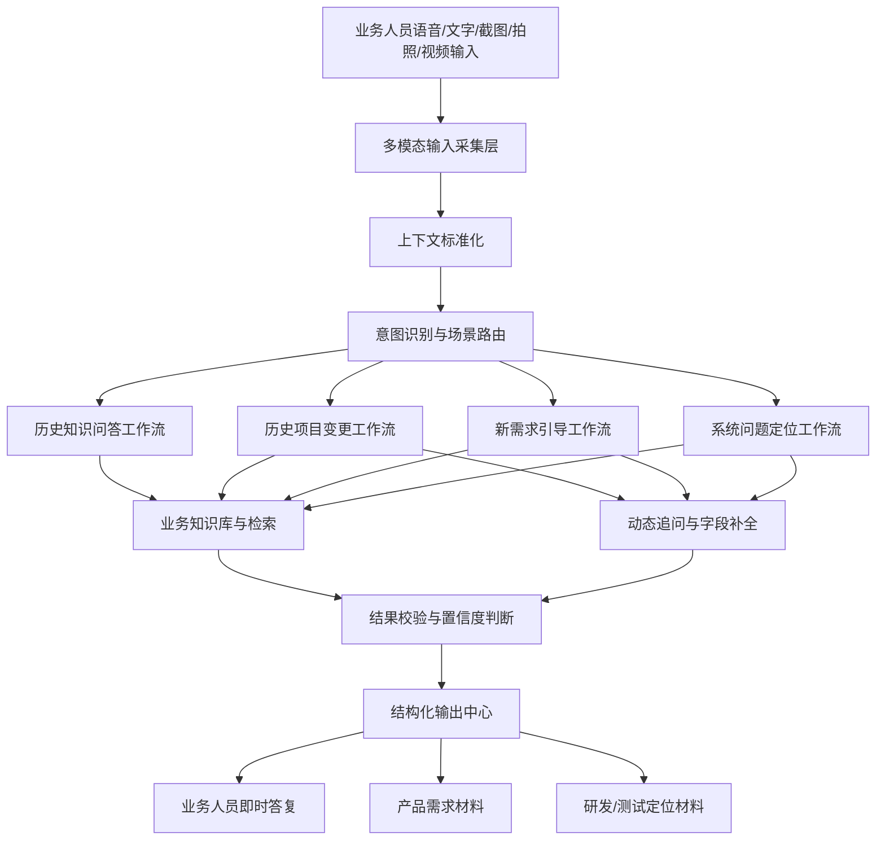

# 保险业务专业机器人设计方案

日期：2026-06-05

## 目标

研发一个面向市场、运营、业务线及相关系统使用方的保险业务专业机器人。

机器人作为统一的业务交互入口，允许业务人员通过语音、文字、截图、拍照、视频等方式自然表达问题、需求、变更背景和系统使用反馈。机器人负责识别场景、追问缺失信息、查询历史业务知识，并将交互结果整理成产品、研发、测试可以直接消费的结构化材料。

核心定位：**业务人员是主要使用者，产品和研发是结构化输出的下游接收方。**

## 产品定位

机器人不是简单 FAQ 问答工具，而是一个面向业务人员的智能业务工作台。

它需要统一支持四类核心场景：

1. 历史业务知识查询。
2. 历史项目变更需求采集。
3. 新需求引导与提炼。
4. 现有系统问题定位与优化建议采集。

业务人员不需要先理解产品文档规范、技术接口细节、系统字段名称或研发术语。机器人负责把业务人员的零散表达转化为清晰、可流转、可判断的产品和研发输入。

## 输入能力

机器人必须支持多模态输入。

### 语音

业务人员可以直接说出需求、问题、背景、客户反馈或变更想法。系统需要完成语音转写，保留原始音频作为证据，并支持在同一会话中持续语音补充。

### 文字

业务人员可以手动输入内容，粘贴客户原话、内部沟通记录、聊天记录，也可以对语音转写结果进行修正。

### 截图

业务人员可以上传内部系统截图、报错截图、菜单路径截图、按钮位置截图或客户反馈截图。机器人需要识别截图中的页面名称、菜单、按钮、字段、错误提示和关键业务线索。

### 拍照

业务人员可以拍摄线下资料、纸质方案、保险条款、合同材料、客户现场资料或手写记录。机器人需要通过 OCR 和图片理解能力提取保险公司、产品名称、费率、条款、项目名称和需求线索。

### 视频

业务人员可以上传视频或录屏。机器人需要提取视频语音转写、关键帧、页面信息、操作路径、报错时点和问题复现步骤。

## 总体架构

## 功能模块

### 1. 多模态输入采集层

该层负责接收语音、文字、截图、拍照和视频，并将原始输入转化为统一的业务上下文。

职责：

- 语音转写。
- 文本清洗与摘要。
- 截图和照片 OCR。
- 系统截图中的页面元素识别。
- 视频关键帧提取。
- 视频语音转写。
- 录屏操作路径提取。
- 附件管理与证据保留。

输出：

- 原始用户输入。
- 转写或识别后的文本。
- 附件元信息。
- 识别出的业务实体。
- 信息提取置信度。

### 2. 意图识别与场景路由

该模块负责判断用户当前处于哪类业务场景。

支持的场景类别：

- 历史知识查询。
- 历史项目变更。
- 新业务需求。
- 系统问题或优化反馈。
- 多场景混合，需要进一步澄清。

机器人需要支持自然语言和不完整表达。例如，“之前那个项目想改一下出单流程”应路由到历史项目变更；“这个页面不好操作”应路由到系统问题定位。

如果意图不明确，机器人应通过简短问题澄清，而不是要求用户先选择表单类型。

### 3. 业务知识库

知识库用于存储和检索历史项目、保险产品、对接方案和系统使用信息。

核心知识类别：

- 平台编号。
- 平台名称。
- 项目名称。
- 保险公司。
- 经纪公司或对接方。
- 保险产品名称。
- 保险条款。
- 费率信息。
- 出单接口编号。
- 支付模式。
- 出单模式。
- 是否见费出单。
- 客户端模式。
- 投保业务流程。
- 产品方案对接记录。
- 线上平台管理信息。
- 历史变更记录。
- 已知系统页面、菜单、按钮和业务操作路径。

知识库应支持按项目名称、平台编号、保险公司、产品名称、接口编号和模糊业务描述进行检索。

### 4. 历史知识问答工作流

该工作流用于回答已有项目的现状问题。

典型问题：

- 这个项目使用什么保险条款？
- 当前费率是多少？
- 使用哪个出单接口编号？
- 对接的是哪家经纪公司？
- 是否为见费出单？
- 当前投保流程是什么？

预期行为：

- 识别目标项目。
- 检索已有业务信息。
- 用业务人员能理解的语言回答。
- 当项目定位不确定时明确提示不确定性。
- 缺少信息时追问平台编号、项目名称、保险公司等关键字段。
- 有知识来源时展示来源依据。

### 5. 历史项目变更工作流

该工作流用于帮助业务人员准确描述历史项目变更。

机器人必须采集：

- 平台编号。
- 项目名称。
- 保险公司。
- 原业务方案。
- 目标变更方案。
- 变更原因。
- 影响的用户或业务场景。
- 是否涉及支付、出单、费率、条款、接口或平台流程变化。
- 期望生效时间或业务紧急程度。
- 相关截图、文件或客户原话。

机器人需要对比原方案和目标方案，并明确总结：

- 哪些内容保持不变。
- 哪些内容发生变化。
- 可能影响哪些系统、接口、流程或配置。
- 仍需业务确认的问题。

### 6. 新需求引导工作流

该工作流用于帮助业务人员梳理完全陌生的新需求。

机器人必须引导用户明确：

- 金融或保险产品类型。
- 目标平台或渠道。
- 业务目标。
- 用户交易场景。
- 投保业务流程。
- 金融端或保险端对接模式。
- 支付要求。
- 出单要求。
- 所需客户信息。
- 面向用户的使用体验。
- 后台管理要求。
- 报表、对账或数据导出要求。
- 对保险公司、经纪公司、支付方或外部平台的依赖。

机器人不应过早向业务人员提出技术问题。它应先理解业务场景，再把业务表达转化为产品和研发需要关注的问题。

### 7. 系统问题定位与优化工作流

该工作流用于处理内部运营或业务线人员对现有系统的使用反馈。

典型输入：

- “这个功能不好用。”
- “找不到按钮。”
- “客户说这个页面报错。”
- “这个流程太麻烦。”
- “我发你一张截图。”
- “我录屏给你看。”

机器人必须采集：

- 平台或系统名称。
- 菜单位置。
- 页面名称。
- 按钮、字段或操作对象。
- 操作路径。
- 期望结果。
- 实际结果。
- 错误提示。
- 用户角色或权限上下文。
- 截图、照片或视频证据。
- 发生频率和业务影响。

机器人必须输出：

- 问题描述。
- 用户目的。
- 复现步骤。
- 影响页面或功能。
- 可能原因分类。
- 优化建议方向。
- 仍需业务补充的信息。
- 研发和测试关注点。

## 对话行为

机器人应表现为专业的业务助理。

交互原则：

- 接受自然语言表达。
- 支持语音优先交互。
- 不在一开始要求用户填写长表单。
- 每次只提出少量聚焦问题。
- 利用历史知识减少重复追问。
- 对重要假设进行确认。
- 保留原始输入和识别证据。
- 区分已确认事实和机器人推断结论。
- 明确标注缺失信息。

示例：

业务人员：“之前 A 平台那个保险项目想改一下出单流程。”

机器人：“我先帮你定位项目。你说的是平台编号 A001 的项目吗？保险公司是人保吗？”

业务人员：“对，A001，人保。”

机器人：“当前项目记录显示该项目是见费出单模式。你这次是想改成先出单后支付，还是只调整出单接口调用时点？”

## 结构化输出

机器人需要面向不同下游角色生成结构化输出。

### 业务人员即时答复

用于当场回复业务人员。

包括：

- 直接答案。
- 相关项目或系统上下文。
- 信息不足时的追问。
- 必要时展示置信度。

### 产品需求材料

用于产品经理判断需求范围和业务价值。

包括：

- 需求类型。
- 业务背景。
- 目标用户或业务场景。
- 当前方案。
- 目标方案。
- 业务价值。
- 范围边界。
- 流程影响。
- 配置影响。
- 待确认问题。
- 相关证据。

### 研发与测试定位材料

用于研发和测试进行初步判断。

包括：

- 涉及系统或模块。
- 涉及平台或项目。
- 已知接口、页面、菜单、按钮或数据字段。
- 系统问题复现步骤。
- 期望表现。
- 实际表现。
- 可能影响的流程。
- 可能依赖项。
- 测试关注点。
- 缺失的技术信息。

## 输出模板

### 历史项目变更需求单

必备章节：

- 基础信息。
- 原方案。
- 目标变更。
- 变更原因。
- 影响范围。
- 业务流程对比。
- 产品关注点。
- 研发和测试关注点。
- 已确认信息。
- 缺失信息。
- 原始用户输入和附件。

### 新需求采集单

必备章节：

- 需求背景。
- 业务目标。
- 目标平台或渠道。
- 用户场景。
- 产品或保险类型。
- 业务流程。
- 支付要求。
- 出单要求。
- 外部对接要求。
- 后台管理要求。
- 数据和报表要求。
- 产品关注点。
- 研发和测试关注点。
- 待确认问题。

### 系统问题或优化反馈单

必备章节：

- 问题摘要。
- 用户目的。
- 涉及系统和页面。
- 操作路径。
- 期望结果。
- 实际结果。
- 复现步骤。
- 截图、照片或视频证据。
- 业务影响。
- 优化建议方向。
- 产品关注点。
- 研发和测试关注点。
- 缺失信息。

## 数据与集成要求

机器人需要接入业务数据源。

必需数据源：

- 历史项目库或项目导出记录。
- 线上平台管理信息。
- 产品方案对接记录。
- 保险产品和条款文档。
- 费率表。
- 接口编号和对接记录。
- 系统菜单、页面和操作元数据。
- 历史需求和问题记录。

建议集成能力：

- 知识文档导入。
- 知识人工维护。
- 项目信息同步。
- 附件上传和存储。
- 会话记录存储。
- 结构化结果导出。
- 需求或问题系统流转。

## 校验与置信度

机器人不能把不确定信息当作确定事实输出。

规则：

- 项目定位不确定时，追问平台编号、项目名称或保险公司。
- 截图、照片或视频识别不清时，要求用户确认。
- 知识库检索出冲突记录时，展示冲突并要求确认。
- 需求信息不完整时，可以输出已完成部分，同时列出缺失信息。
- 系统问题无法直接诊断时，仍需生成可用的问题采集摘要。

## 非目标

机器人不负责自动审批需求，不直接修改生产系统配置，也不替代产品经理、研发和测试的最终判断。

机器人负责准备高质量输入并提供即时业务辅助。最终产品决策、技术设计、开发、测试和生产变更仍由现有团队负责。

## 成功标准

该设计达到目标的标准：

- 业务人员可以通过语音、文字、截图、拍照或视频自然表达问题。
- 机器人可以将会话路由到四类核心工作流。
- 历史项目问题可以基于结构化知识回答。
- 变更需求能同时说明原方案和目标方案。
- 新需求能覆盖业务场景、流程、支付、出单和外部对接上下文。
- 系统问题能包含页面、操作路径、期望结果、实际结果、证据和复现步骤。
- 产品经理收到的需求材料更清晰，重复澄清次数减少。
- 研发和测试能基于输出进行初步技术判断，或提出更聚焦的补充问题。

## 评审说明

本设计将机器人定义为一个完整的多模态业务工作台。后续研发计划可以按依赖关系安排建设顺序，但产品能力边界应保持完整，而不是拆成互不关联的小工具。
