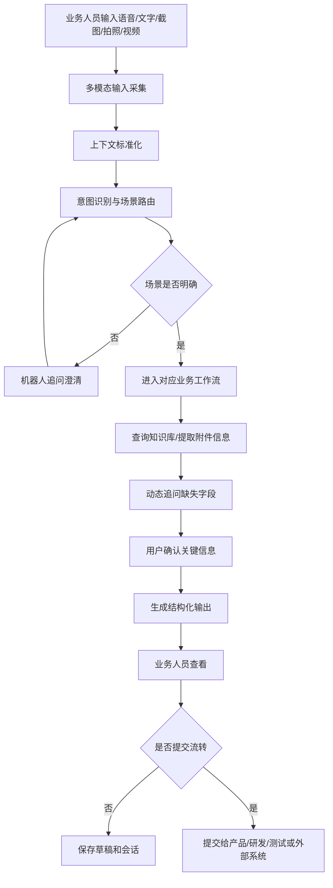

# 保险业务专业机器人 PRD

版本：V1.0  
日期：2026-06-05  
状态：待评审  
主要使用方：市场、运营、业务线及相关系统使用方  
下游接收方：产品、研发、测试

## 1. 背景

当前市场、运营及业务线人员在推进保险项目、反馈系统问题、提出客户变更诉求时，常见问题包括：

- 历史项目资料分散，业务人员需要反复询问产品或研发才能确认条款、费率、接口编号、出单模式、对接方等信息。
- 历史项目变更描述不完整，产品经理需要多轮追问“原来是什么、现在要改成什么、影响哪些流程”。
- 新需求初期表达通常偏业务化，缺少工程化输入，导致产品、研发前期沟通成本高。
- 系统使用问题经常以“不好用”“报错了”“找不到按钮”等形式出现，缺少页面、路径、角色、截图、复现步骤等定位信息。
- 业务人员更习惯口头表达、截图说明、拍照上传资料或录屏复现问题，不适合一开始就填写长表单。

因此需要建设一个面向业务人员的保险业务专业机器人，让业务人员通过自然语言和多模态输入表达问题，由机器人完成场景识别、追问补全、知识检索、问题定位和结构化输出。

## 2. 产品目标

建设一个面向业务人员的多模态业务工作台型机器人。

机器人需要做到：

- 业务人员可以通过语音、文字、截图、拍照、视频自然输入。
- 机器人可以识别用户是在查询历史知识、提出历史项目变更、提出新需求，还是反馈系统问题。
- 机器人可以基于历史知识库回答项目现状问题。
- 机器人可以通过追问把业务人员的零散表达整理成产品和研发可消费的结构化材料。
- 机器人可以保留原始输入、附件、识别结果、追问记录和确认记录，作为后续需求或问题流转依据。

## 3. 成功指标

上线后应重点观察以下指标：

- 业务人员可以独立完成历史项目现状查询。
- 历史项目变更需求单中“原方案”和“目标方案”的完整率提升。
- 产品经理针对业务描述进行重复澄清的次数下降。
- 系统问题反馈中包含页面、操作路径、期望结果、实际结果、证据、复现步骤的比例提升。
- 研发和测试收到的问题定位材料后，可以进行初步判断或提出更聚焦的补充问题。
- 机器人生成的结构化输出被产品、研发、测试接受并进入后续流转。

## 4. 用户与角色

### 4.1 业务人员

包括市场、运营、商务、业务线支持、平台对接人员等。

主要行为：

- 用语音或文字描述问题、需求和变更。
- 上传截图、照片、视频、录屏等材料。
- 回答机器人追问。
- 确认机器人总结是否准确。
- 查看即时答复或提交结构化输出。

### 4.2 产品经理

主要行为：

- 接收机器人生成的需求材料。
- 查看业务背景、当前方案、目标方案、影响范围和待确认问题。
- 基于结构化材料继续产品方案设计。

### 4.3 研发人员

主要行为：

- 接收机器人生成的研发关注点。
- 查看涉及系统、接口、页面、流程、配置、依赖和可能影响范围。
- 基于结构化材料进行技术初判。

### 4.4 测试人员

主要行为：

- 接收系统问题复现步骤、期望结果、实际结果、证据和测试关注点。
- 基于结构化材料设计验证范围和测试用例。

### 4.5 知识库管理员

主要行为：

- 导入或维护历史项目资料、条款、费率、接口编号、系统菜单和操作路径。
- 处理知识冲突、过期信息和缺失信息。
- 管理知识来源和更新时间。

## 5. 使用入口

机器人需要支持多入口使用，具体入口可根据现有系统条件配置：

- PC 端工作台入口。
- 移动端入口。
- 内部后台系统嵌入入口。
- 企业 IM 入口。
- 需求或工单系统入口。

入口要求：

- 同一用户在不同入口发起的会话应能关联到统一会话记录。
- 支持上传附件。
- 支持语音录入和语音转写。
- 支持查看机器人生成的结构化输出。
- 支持将输出提交给产品、研发或问题流转系统。

## 6. 产品范围

### 6.1 本期范围

机器人作为完整业务工作台，需要覆盖以下能力：

- 多模态输入采集。
- 语音转写。
- 截图和照片 OCR。
- 视频或录屏关键信息提取。
- 意图识别与场景路由。
- 历史业务知识问答。
- 历史项目变更需求采集。
- 新需求引导与提炼。
- 系统问题定位与优化建议采集。
- 结构化输出生成。
- 会话记录和附件证据保存。
- 知识库检索和引用来源展示。
- 置信度和不确定信息提示。

### 6.2 非目标

机器人不负责：

- 自动审批需求。
- 直接修改生产系统配置。
- 自动上线产品变更。
- 替代产品经理的最终产品判断。
- 替代研发的技术设计。
- 替代测试的完整测试验证。

机器人负责准备高质量输入并提供即时业务辅助，最终决策和实施仍由现有团队负责。

## 7. 核心业务场景

### 7.1 历史业务知识查询

业务人员询问已有项目的现状，例如条款、费率、接口编号、经纪公司、投保流程、支付模式、出单模式等。

目标：

- 快速回答业务问题。
- 降低业务人员对产品和研发的重复咨询。
- 对不确定或冲突信息明确提示。

### 7.2 历史项目变更需求采集

业务人员针对已有项目提出变更，例如调整出单流程、变更费率、替换保险公司、调整接口、修改页面流程等。

目标：

- 精准定位历史项目。
- 明确原方案和目标方案。
- 输出变更影响范围。
- 在流转给产品经理前完成初步梳理。

### 7.3 新需求引导与提炼

业务人员提出陌生新需求，但尚未形成完整产品方案。

目标：

- 引导业务人员讲清业务目标、用户场景、交易流程、支付要求、出单要求、外部对接和后台管理诉求。
- 避免过早要求业务人员回答技术细节。
- 将业务描述转化为产品和研发可继续分析的材料。

### 7.4 系统问题定位与优化反馈

业务人员反馈现有系统不好用、找不到功能、页面报错、流程太长、按钮不清楚等问题。

目标：

- 采集系统、页面、菜单、按钮、角色、操作路径、期望结果、实际结果和证据。
- 通过截图、照片、视频和录屏辅助定位。
- 输出问题摘要、复现步骤、影响范围和优化建议方向。

## 8. 总体流程

## 9. 功能需求

### FR-001 多模态输入采集

机器人必须支持以下输入：

- 语音。
- 文字。
- 截图。
- 拍照。
- 视频。
- 录屏。

规则：

- 每次输入都需要保存原始内容。
- 每次输入都需要生成可追溯的识别结果。
- 附件需要关联到对应会话和结构化输出。
- 用户可以在同一会话中混合使用多种输入方式。

验收标准：

- 用户可以在同一会话中先语音描述，再上传截图，再用文字补充。
- 结构化输出中可以看到附件引用和关键识别结果。

### FR-002 语音转写

机器人需要将用户语音转为文字。

规则：

- 保留原始音频。
- 展示转写文本供用户确认或修改。
- 支持同一会话内多段语音追加。
- 转写内容需要进入后续意图识别和需求提炼。

验收标准：

- 用户语音输入后，系统生成文字转写。
- 用户修改转写后，后续总结使用修正后的内容。

### FR-003 截图和照片识别

机器人需要识别截图和照片中的文字与业务线索。

规则：

- 对系统截图识别页面名称、菜单、按钮、字段、错误提示。
- 对业务资料照片识别保险公司、产品名称、条款、费率、项目名称等。
- 识别不清时要求用户确认。

验收标准：

- 用户上传报错截图后，机器人能提取错误提示并追问操作路径。
- 用户上传条款照片后，机器人能提取可读的核心文字并标记不确定内容。

### FR-004 视频和录屏识别

机器人需要处理视频或录屏。

规则：

- 提取视频语音转写。
- 提取关键帧。
- 识别可见页面、菜单、按钮、错误提示。
- 总结操作路径和问题复现步骤。

验收标准：

- 用户上传系统录屏后，机器人可以输出初步复现步骤。
- 如果视频信息不足，机器人需要明确指出缺少的上下文。

### FR-005 意图识别与场景路由

机器人需要判断用户输入属于哪类场景。

场景：

- 历史知识查询。
- 历史项目变更。
- 新需求引导。
- 系统问题定位。
- 多场景混合。

规则：

- 不要求用户先选择表单。
- 意图不明确时，机器人通过简短追问确认。
- 允许一个会话中从问答切换到需求采集。

验收标准：

- “这个项目是不是见费出单”路由到历史知识查询。
- “客户想把之前项目的出单流程改一下”路由到历史项目变更。
- “我们有个新渠道想接保险产品”路由到新需求引导。
- “后台这个按钮不好找”路由到系统问题定位。

### FR-006 历史业务知识问答

机器人需要回答已有项目的业务现状。

支持查询：

- 平台编号。
- 平台名称。
- 项目名称。
- 保险公司。
- 经纪公司或对接方。
- 保险产品。
- 条款。
- 费率。
- 出单接口编号。
- 支付模式。
- 出单模式。
- 是否见费出单。
- 客户端模式。
- 投保流程。

规则：

- 需要先定位项目。
- 项目不唯一时追问关键字段。
- 回答应展示知识来源或来源摘要。
- 信息冲突时展示冲突并要求确认。

验收标准：

- 用户给出平台编号后，机器人能返回该项目的关键业务信息。
- 用户只给出模糊项目名且匹配多个项目时，机器人不直接猜测唯一答案。

### FR-007 历史项目变更需求采集

机器人需要采集历史项目变更信息。

必采字段：

- 平台编号。
- 项目名称。
- 保险公司。
- 原业务方案。
- 目标变更方案。
- 变更原因。
- 影响用户或业务场景。
- 涉及支付、出单、费率、条款、接口、页面或流程的范围。
- 期望生效时间。
- 紧急程度。
- 相关附件或客户原话。

规则：

- 机器人必须对比原方案和目标方案。
- 如果原方案可从知识库获取，机器人应主动带出并要求确认。
- 如果目标方案不清楚，机器人应追问“希望改成什么”而不是直接输出需求单。

验收标准：

- 输出中必须包含“原方案”“目标方案”“变化点”“不变点”“影响范围”“待确认问题”。

### FR-008 新需求引导与提炼

机器人需要引导业务人员梳理新需求。

必采字段：

- 需求背景。
- 业务目标。
- 目标平台或渠道。
- 金融或保险产品类型。
- 用户交易场景。
- 投保流程。
- 支付要求。
- 出单要求。
- 外部对接对象。
- 后台管理诉求。
- 报表、对账或数据导出诉求。
- 期望上线时间或业务紧急程度。

规则：

- 先问业务场景，再逐步提炼产品和研发关注点。
- 不应要求业务人员直接提供接口协议、数据库字段等技术细节。
- 对用户说不清的内容，机器人应给出可选择的业务化选项。

验收标准：

- 用户只说“新渠道想接保险产品”时，机器人能引导补齐平台、产品、场景、支付、出单和对接边界。

### FR-009 系统问题定位与优化反馈

机器人需要采集和提炼系统问题。

必采字段：

- 系统名称。
- 平台或项目。
- 菜单位置。
- 页面名称。
- 按钮、字段或操作对象。
- 用户角色或权限。
- 操作路径。
- 期望结果。
- 实际结果。
- 错误提示。
- 发生频率。
- 业务影响。
- 截图、照片、视频或录屏证据。

规则：

- 当用户只说“不好用”时，机器人应追问具体页面、操作目标和卡点。
- 当用户上传截图或录屏时，机器人应结合视觉信息生成问题摘要。
- 无法定位原因时，也必须输出可流转的问题采集单。

验收标准：

- 输出中必须包含“问题是什么”“用户目的是什么”“怎么复现”“影响哪里”“建议怎么优化”“还缺什么信息”。

### FR-010 结构化输出中心

机器人需要生成三类输出。

#### 业务人员即时答复

包含：

- 直接答案。
- 相关项目或系统上下文。
- 机器人判断依据。
- 需要用户确认的问题。

#### 产品需求材料

包含：

- 需求类型。
- 业务背景。
- 目标用户或业务场景。
- 当前方案。
- 目标方案。
- 业务价值。
- 范围边界。
- 流程影响。
- 配置影响。
- 待确认问题。
- 附件和证据。

#### 研发与测试定位材料

包含：

- 涉及系统或模块。
- 涉及平台或项目。
- 已知接口、页面、菜单、按钮或数据字段。
- 复现步骤。
- 期望表现。
- 实际表现。
- 可能影响流程。
- 可能依赖项。
- 测试关注点。
- 缺失技术信息。

验收标准：

- 同一会话可以生成面向业务人员、产品、研发测试的不同摘要。
- 输出中明确区分已确认信息、机器人推断和缺失信息。

### FR-011 知识库检索与来源展示

机器人需要基于知识库回答和辅助判断。

知识类别：

- 历史项目资料。
- 线上平台管理信息。
- 产品方案对接记录。
- 保险条款文档。
- 费率表。
- 接口编号和对接记录。
- 系统菜单、页面和操作元数据。
- 历史需求和问题记录。

规则：

- 检索结果需要保留来源。
- 回答历史事实时应展示来源摘要。
- 知识冲突时不能直接合并为确定结论。
- 知识过期时应提示更新时间。

验收标准：

- 历史知识问答输出中包含来源或来源摘要。
- 冲突记录会触发用户确认或管理员处理。

### FR-012 知识库管理

系统需要支持知识维护。

能力：

- 文档导入。
- 项目资料导入。
- 条款和费率表导入。
- 系统菜单和页面元数据维护。
- 知识来源记录。
- 知识更新时间记录。
- 冲突知识标记。
- 人工修正和审核。

验收标准：

- 管理员可以查看某条知识的来源、更新时间和维护人。
- 管理员可以标记冲突或过期知识。

### FR-013 会话与证据管理

机器人需要保存完整会话过程。

保存内容：

- 用户原始输入。
- 语音转写。
- 图片 OCR 结果。
- 视频关键帧和转写摘要。
- 机器人追问。
- 用户确认。
- 结构化输出。
- 附件。
- 关联知识来源。

规则：

- 会话可以保存为草稿。
- 会话可以继续补充。
- 输出提交后仍可追溯生成依据。

验收标准：

- 产品或研发查看结构化输出时，可以回看原始输入和附件证据。

### FR-014 结果流转

机器人需要支持将结构化输出提交给下游。

流转对象：

- 产品经理。
- 研发人员。
- 测试人员。
- 需求管理系统。
- 问题或工单系统。

规则：

- 提交前需要业务人员确认。
- 提交后记录提交时间、提交人、接收对象和输出版本。
- 支持输出为 Markdown、表单字段或接口数据。

验收标准：

- 业务人员确认后，可以将需求单或问题单提交给指定下游。
- 下游可以看到完整结构化材料和附件证据。

### FR-015 置信度与异常处理

机器人需要处理不确定、冲突和信息不足的情况。

规则：

- 项目定位不确定时，必须追问。
- 截图、照片、视频识别不清时，必须要求确认。
- 知识库返回冲突信息时，必须展示冲突。
- 需求不完整时，可以输出已完成部分，并列出缺失信息。
- 系统问题无法诊断时，也需要生成问题采集摘要。

验收标准：

- 机器人不会把不确定信息表述为确定事实。
- 输出中能看到“已确认信息”“待确认信息”“机器人推断”。

## 10. 输出模板

### 10.1 历史项目变更需求单

字段：

- 需求标题。
- 需求类型。
- 平台编号。
- 平台名称。
- 项目名称。
- 保险公司。
- 经纪公司或对接方。
- 原业务方案。
- 目标变更方案。
- 变化点。
- 不变点。
- 变更原因。
- 影响用户或业务场景。
- 影响系统、接口、页面、流程或配置。
- 期望生效时间。
- 紧急程度。
- 产品关注点。
- 研发和测试关注点。
- 已确认信息。
- 待确认信息。
- 原始输入摘要。
- 附件和证据。
- 知识来源。

### 10.2 新需求采集单

字段：

- 需求标题。
- 需求背景。
- 业务目标。
- 目标平台或渠道。
- 用户场景。
- 金融或保险产品类型。
- 业务流程。
- 支付要求。
- 出单要求。
- 外部对接对象。
- 后台管理要求。
- 数据、报表或对账要求。
- 期望上线时间。
- 紧急程度。
- 产品关注点。
- 研发和测试关注点。
- 待确认问题。
- 原始输入摘要。
- 附件和证据。

### 10.3 系统问题或优化反馈单

字段：

- 问题标题。
- 问题类型。
- 系统名称。
- 平台或项目。
- 菜单位置。
- 页面名称。
- 按钮、字段或操作对象。
- 用户角色或权限。
- 操作路径。
- 期望结果。
- 实际结果。
- 错误提示。
- 复现步骤。
- 发生频率。
- 业务影响。
- 可能原因分类。
- 优化建议方向。
- 产品关注点。
- 研发和测试关注点。
- 待确认信息。
- 原始输入摘要。
- 截图、照片、视频或录屏证据。

## 11. 权限需求

权限应按角色控制。

业务人员：

- 发起会话。
- 上传附件。
- 查看本人会话。
- 编辑和确认本人会话输出。
- 提交结构化结果。

产品经理：

- 查看分配给自己的需求材料。
- 查看相关原始输入和附件。
- 补充产品处理意见。

研发和测试：

- 查看分配给自己的研发测试材料。
- 查看复现步骤、证据和相关上下文。
- 补充技术或测试反馈。

知识库管理员：

- 导入和维护知识。
- 标记知识冲突和过期。
- 修正知识来源和有效性。

系统管理员：

- 管理用户、角色、权限和系统配置。

## 12. 数据需求

### 12.1 会话数据

关键字段：

- 会话 ID。
- 发起人。
- 发起入口。
- 场景类型。
- 会话状态。
- 原始输入。
- 识别结果。
- 机器人追问。
- 用户确认。
- 结构化输出版本。
- 关联附件。
- 关联知识来源。
- 创建时间。
- 更新时间。

### 12.2 附件数据

关键字段：

- 附件 ID。
- 附件类型。
- 文件名称。
- 文件地址。
- 上传人。
- 上传时间。
- 关联会话。
- 识别文本。
- 关键帧摘要。
- 识别置信度。

### 12.3 知识数据

关键字段：

- 知识 ID。
- 知识类型。
- 平台编号。
- 项目名称。
- 保险公司。
- 产品名称。
- 条款。
- 费率。
- 接口编号。
- 出单模式。
- 支付模式。
- 来源系统或来源文档。
- 生效状态。
- 更新时间。
- 维护人。
- 冲突标记。

### 12.4 输出数据

关键字段：

- 输出 ID。
- 输出类型。
- 会话 ID。
- 面向角色。
- 输出内容。
- 已确认信息。
- 待确认信息。
- 机器人推断。
- 附件证据。
- 知识来源。
- 提交状态。
- 接收对象。
- 提交时间。

## 13. 集成需求

### 13.1 数据源集成

需要接入或导入：

- 历史项目库。
- 线上平台管理系统。
- 产品方案对接记录。
- 保险条款文档。
- 费率表。
- 接口编号和对接记录。
- 系统菜单、页面和按钮元数据。
- 历史需求和问题记录。

### 13.2 输出流转集成

需要支持：

- 输出为 Markdown。
- 输出为结构化表单。
- 通过接口提交到需求管理系统。
- 通过接口提交到问题或工单系统。
- 附件随结构化输出一并流转。

## 14. 非功能需求

### 14.1 可用性

- 业务人员应能用自然语言开始会话。
- 系统不应在会话开始时强制填写完整表单。
- 机器人追问应简短、聚焦、易回答。

### 14.2 可追溯性

- 所有结构化输出必须能追溯到原始输入、附件和知识来源。
- 关键确认动作需要记录确认人和确认时间。

### 14.3 安全与权限

- 不同角色只能查看权限范围内的会话、附件和输出。
- 涉及客户资料、保险条款、合同、费率等敏感内容时，需要按公司现有安全策略处理。

### 14.4 稳定性

- 单个会话中断后应能继续。
- 附件处理失败时，不应影响文字或语音会话继续进行。

### 14.5 可维护性

- 知识库需要支持人工维护和来源追踪。
- 工作流追问规则需要可配置或可迭代调整。

## 15. 页面与交互需求

### 15.1 会话页

需要包含：

- 输入区。
- 语音录入入口。
- 文字输入入口。
- 附件上传入口。
- 会话消息区。
- 机器人追问和用户确认区。
- 结构化输出预览区。

### 15.2 输出确认页

需要包含：

- 输出类型。
- 已确认信息。
- 待确认信息。
- 机器人推断。
- 附件和证据。
- 知识来源。
- 编辑入口。
- 提交流转入口。

### 15.3 知识管理页

需要包含：

- 知识列表。
- 知识详情。
- 来源信息。
- 更新时间。
- 冲突标记。
- 人工修正入口。

## 16. 状态流转

会话状态：

- 草稿。
- 采集中。
- 待用户确认。
- 已生成输出。
- 已提交。
- 已关闭。

输出状态：

- 草稿。
- 待确认。
- 已确认。
- 已提交。
- 已退回补充。

知识状态：

- 有效。
- 待审核。
- 已过期。
- 存在冲突。

## 17. 验收标准汇总

系统上线验收时至少满足：

- 支持语音、文字、截图、拍照、视频或录屏输入。
- 支持一个会话中混合使用多种输入方式。
- 能识别四类核心业务场景。
- 历史知识查询能返回项目现状并展示来源。
- 历史项目变更输出包含原方案、目标方案、变化点、不变点、影响范围。
- 新需求输出包含业务目标、用户场景、流程、支付、出单、外部对接和后台管理诉求。
- 系统问题输出包含系统页面、操作路径、期望结果、实际结果、复现步骤和证据。
- 输出明确区分已确认信息、待确认信息和机器人推断。
- 结构化输出可以提交给产品、研发或测试。
- 下游可以查看原始输入、附件和知识来源。

## 18. 风险与约束

- 历史知识质量会直接影响问答准确率。
- 业务资料和历史项目记录可能存在缺失、过期或冲突。
- 截图、照片和视频识别结果可能受清晰度影响。
- 语音转写可能受环境噪音、方言、专有名词影响。
- 机器人不能替代产品和研发最终判断，输出需要保留确认和追溯机制。

## 19. 评审重点

评审时建议重点确认：

- 四类业务场景是否完整覆盖实际工作。
- 输出模板是否满足产品、研发、测试接收需求。
- 必采字段是否过多或过少。
- 知识库数据源是否可获得。
- 结果流转对象和系统是否明确。
- 权限和敏感数据处理是否符合公司要求。

## 20. 后续研发计划说明

本 PRD 定义完整产品能力边界。后续研发计划可以按数据依赖、入口建设、多模态处理、知识库建设、对话工作流、输出流转等模块拆分任务，但不改变产品整体定位：**一个面向业务人员的多模态保险业务专业机器人**。
