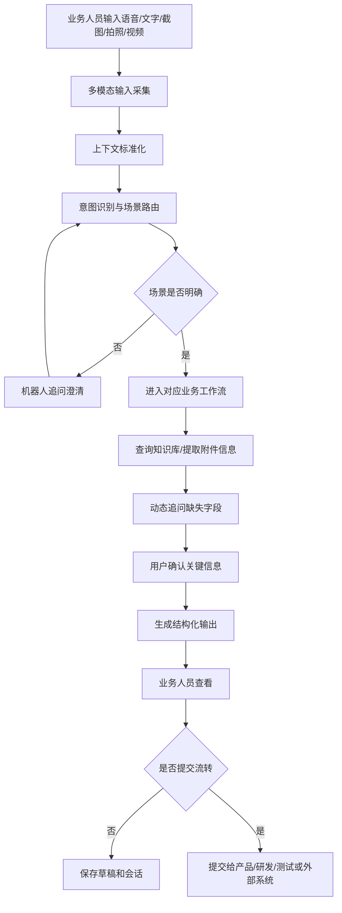
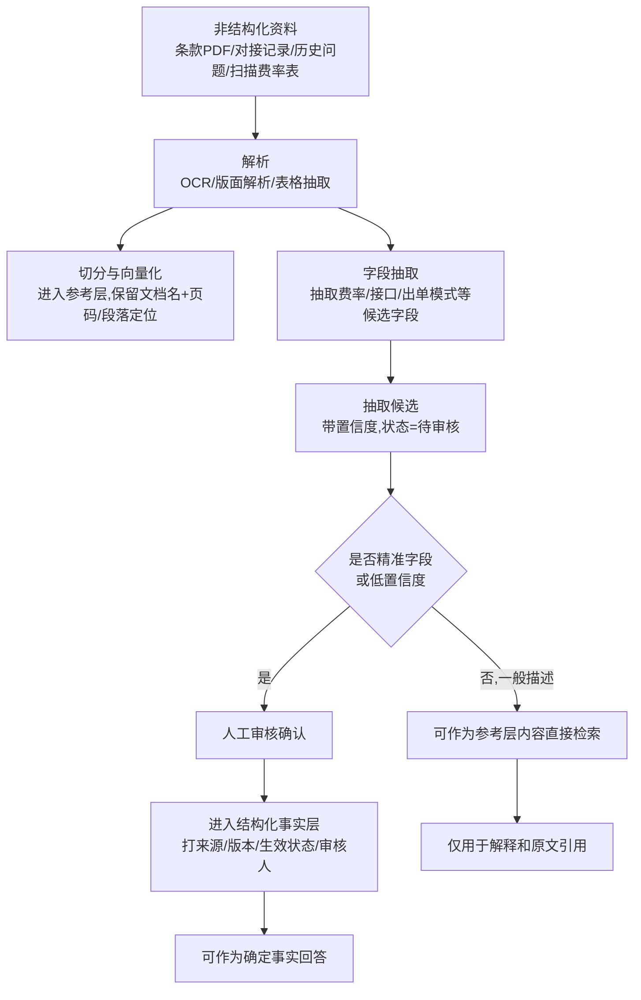
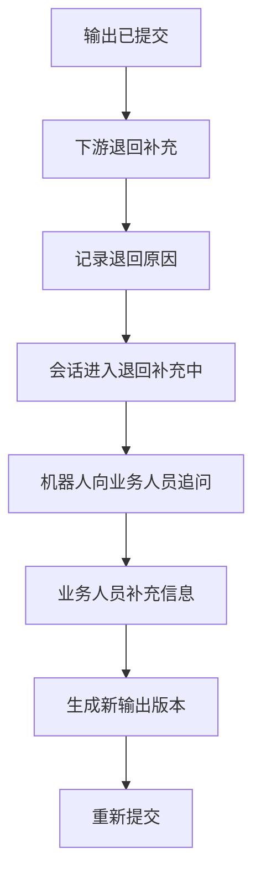
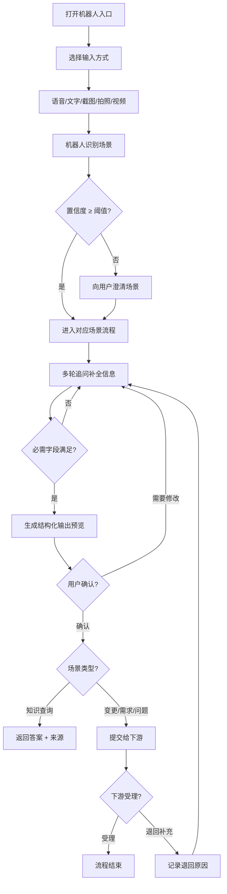
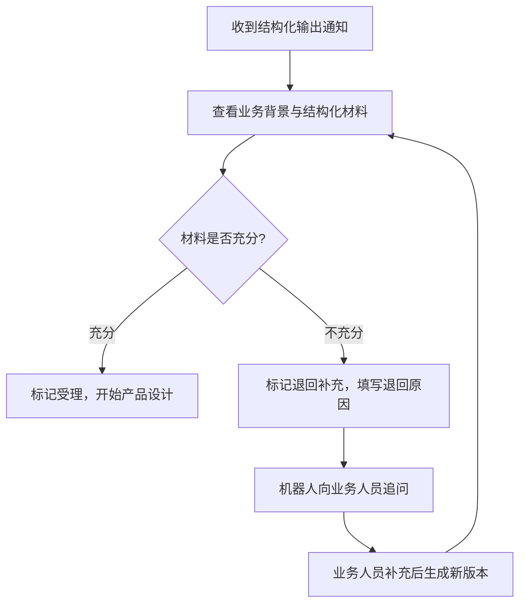
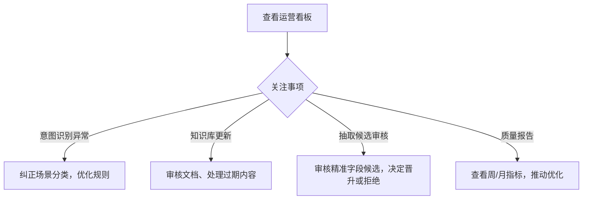
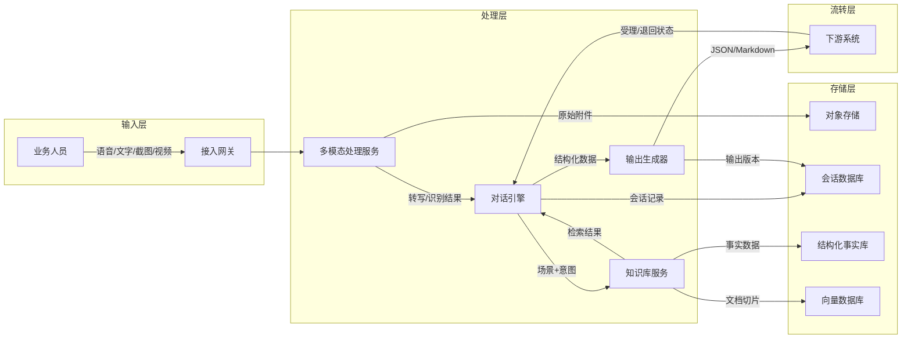
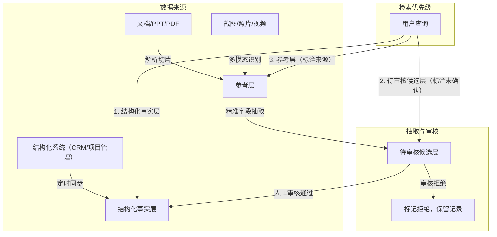

# 保险业务专业机器人 PRD

版本：V1.4  
日期：2026-06-06  
状态：待评审  
主要使用方：市场、运营、业务线及相关系统使用方  
下游接收方：产品、研发、测试

## 1. 背景

当前市场、运营及业务线人员在推进保险项目、反馈系统问题、提出客户变更诉求时，常见问题包括：

- 历史项目资料分散，业务人员需要反复询问产品或研发才能确认条款、费率、接口编号、出单模式、对接方等信息。
- 历史项目变更描述不完整，产品经理需要多轮追问“原来是什么、现在要改成什么、影响哪些流程”。
- 新需求初期表达通常偏业务化，缺少工程化输入，导致产品、研发前期沟通成本高。
- 系统使用问题经常以“不好用”“报错了”“找不到按钮”等形式出现，缺少页面、路径、角色、截图、复现步骤等定位信息。
- 业务人员更习惯口头表达、截图说明、拍照上传资料或录屏复现问题，不适合一开始就填写长表单。

因此需要建设一个面向业务人员的保险业务专业机器人，让业务人员通过自然语言和多模态输入表达问题，由机器人完成场景识别、追问补全、知识检索、问题定位和结构化输出。

## 2. 产品目标

建设一个面向业务人员的多模态业务工作台型机器人。

机器人需要做到：

- 业务人员可以通过语音、文字、截图、拍照、视频自然输入。
- 机器人可以识别用户是在查询历史知识、提出历史项目变更、提出新需求，还是反馈系统问题。
- 机器人可以基于历史知识库回答项目现状问题。
- 机器人可以通过追问把业务人员的零散表达整理成产品和研发可消费的结构化材料。
- 机器人可以保留原始输入、附件、识别结果、追问记录和确认记录，作为后续需求或问题流转依据。

## 3. 系统架构与技术约束

### 技术架构概览

系统采用前后端分离架构，核心组件包括：

- **接入层**：统一入口（企微/钉钉/飞书 Bot 或独立 Web 端），支持多模态输入接收。
- **对话引擎层**：负责意图识别、场景路由、多轮追问编排、会话状态管理。
- **多模态处理层**：集成 ASR（语音转写）、OCR/VLM（图片识别）、视频/录屏分析服务。
- **知识库服务层**：结构化事实库 + 向量检索 + 全文检索混合架构，支持分层检索（结构化事实层 → 待审核候选层 → 参考层）。
- **输出生成层**：根据场景模板生成 Markdown / JSON 结构化输出，支持版本管理和来源追溯。
- **流转集成层**：对接需求管理系统和工单系统，支持提交、受理、退回补充状态回传。

### 部署方式

- 优先采用私有化部署，部署在公司内网 Kubernetes 集群。
- 多模态处理服务（ASR/OCR/VLM）可选择私有化部署或调用公司授权的云端服务，需在评审时确认。
- 向量数据库和结构化数据库独立部署，支持水平扩展。

### 模型选型建议

| 能力 | 建议方向 | 备选 | 备注 |
| --- | --- | --- | --- |
| 意图识别与对话 | 大语言模型（LLM） | 规则引擎 + LLM 混合 | 需支持 prompt 模板热更新 |
| 语音转写（ASR） | 公司已有 ASR 服务 | 商用云服务 | 需支持保险领域热词 |
| 图片/截图识别（OCR/VLM） | 多模态大模型 | OCR + LLM 后处理 | 需支持表格、表单、截图混合识别 |
| 视频/录屏分析 | 关键帧抽取 + VLM | 帧级 OCR + 时序聚合 | 成本高，需异步处理 |

### 知识库存储方案

- **结构化事实层**：关系型数据库（PostgreSQL），存储项目、费率、接口编号、条款等已确认数据。
- **待审核候选层**：与事实层同库，增加审核状态字段，记录从非结构化资料抽取的候选字段。
- **参考层**：向量数据库（如 Milvus/Qdrant）+ 全文检索（Elasticsearch），存储文档切片、截图描述、视频摘要等。
- **附件存储**：对象存储（MinIO / S3 兼容），存储原始截图、照片、视频、录屏文件。

### 系统集成

| 对接系统 | 集成方式 | 用途 |
| --- | --- | --- |
| 企业通讯平台（企微/钉钉/飞书） | Bot API / Webhook | 用户入口、消息收发、附件上传 |
| 需求管理系统（如 Jira/Tapd/自研） | REST API | 新需求 / 变更单提交与状态回传 |
| 工单系统 | REST API | 系统问题提交与状态回传 |
| 知识库数据源（CRM/项目管理/文档库） | 定时同步 + 手动导入 | 知识库冷启动与持续更新 |
| SSO / 统一认证 | OAuth 2.0 / SAML | 用户身份认证与权限获取 |

### 技术约束

- 所有服务部署在公司内网，不得将原始业务数据传输至未授权的外部服务。
- 多模态模型调用需评估数据出境风险，优先使用私有化部署方案。
- 附件存储需满足公司数据分级要求，加密存储并设置访问过期策略。
- 对话引擎需支持 prompt 模板版本管理，便于运营调优。

## 4. 成功指标

上线后应同时观察业务效果、输出质量和系统处理效果。正式上线前需要先统计 2 周人工处理基线，基线不足时使用上线后第 1 周作为试运行基线。

| 指标 | 基线口径 | 目标值 | 度量方式 | 数据采集方式 | 统计周期 |
| --- | --- | --- | --- | --- | --- |
| 历史项目知识查询自助解决率 | 人工询问产品或研发后解决的历史项目查询量 | 上线 1 个月达到 60%，上线 3 个月达到 75% | 已由机器人直接回答且业务人员确认已解决的查询数 / 历史查询总数 | 系统埋点记录“已解决/未解决”反馈；私下转人工追问通过每周抽样访谈或问卷校准 | 周、月 |
| 历史项目变更材料完整率 | 变更材料中同时包含原方案、目标方案、影响范围的比例 | 上线 1 个月达到 70%，上线 3 个月达到 85% | 满足必需字段的变更单数 / 变更单总数 | 系统按字段状态自动统计 | 周、月 |
| 产品经理重复澄清次数 | 产品经理针对同一需求向业务人员补问的平均次数 | 较基线下降 30% | 需求流转后产品在系统内发起的补充问题次数 / 需求数 | 系统内退回补充和评论埋点；系统外私聊通过抽样复盘校准，不作为唯一口径 | 月 |
| 系统问题定位材料完整率 | 问题反馈中包含页面、路径、期望结果、实际结果、证据、复现步骤的比例 | 上线 1 个月达到 65%，上线 3 个月达到 80% | 满足问题定位必需字段的问题单数 / 问题单总数 | 系统按字段状态自动统计 | 周、月 |
| 意图识别人工纠正率 | 用户或运营手动切换场景的比例 | 上线 1 个月低于 15%，上线 3 个月低于 8% | 被人工纠正场景的会话数 / 进入场景路由的会话数 | 系统埋点自动统计 | 周、月 |
| 下游接受率 | 产品、研发、测试明确受理并进入处理的输出比例 | 上线 1 个月达到 70%，上线 3 个月达到 85% | 被下游标记“已受理”或成功建单的输出数 / 已提交输出总数 | 系统埋点、需求系统或工单系统状态回传；无正向受理动作的不计入分子 | 周、月 |
| 输出可追溯率 | 输出中关键结论可追溯到原话、附件或知识来源的比例 | 100% | 抽样检查关键字段是否存在来源引用 | 系统来源链路校验 + 人工抽样审查 | 周 |

## 5. 性能与 SLA

### 响应时间要求

| 场景 | 目标响应时间 | 说明 |
| --- | --- | --- |
| 纯文字对话（意图识别 + 追问） | ≤ 3 秒 | 从用户发送完成到机器人首次响应 |
| 历史知识查询（含检索） | ≤ 5 秒 | 从问题识别完成到返回结果 |
| 语音转写 | ≤ 10 秒 | 60 秒以内的语音片段 |
| 图片/截图识别 | ≤ 8 秒 | 单张图片 |
| 视频/录屏处理 | ≤ 60 秒（异步） | 异步处理，完成后通知用户 |
| 结构化输出生成 | ≤ 10 秒 | 从所有信息收集完成到输出预览 |
| 下游系统提交 | ≤ 5 秒 | 从用户确认提交到下游系统返回受理状态 |

### 并发与容量

| 指标 | 目标值 | 说明 |
| --- | --- | --- |
| 同时在线用户数 | ≥ 200 | 按首批覆盖业务线峰值估算 |
| 同时活跃会话数 | ≥ 100 | 同一时刻正在交互的会话 |
| 日会话总量 | ≥ 2,000 | 单日累计会话数 |
| 单会话最大轮次 | 50 轮 | 超过后建议归档并开启新会话 |
| 单附件大小上限 | 图片 20MB，视频 500MB | 超过时提示压缩或分片上传 |

### 可用性

- 系统整体可用性目标：**99.5%**（月度，不含计划维护窗口）。
- 计划维护窗口：每月不超过 2 次，每次不超过 2 小时，安排在业务低峰时段。
- 多模态处理服务允许独立降级，不影响文字对话和知识查询核心功能。

### 视频/录屏处理规格

| 参数 | 限制 |
| --- | --- |
| 支持格式 | MP4、MOV、AVI、WebM |
| 最大时长 | 5 分钟 |
| 最大分辨率 | 1080p |
| 处理方式 | 异步，上传后立即返回"处理中"状态 |
| 失败重试 | 最多自动重试 2 次，仍失败则通知用户手动重传 |
| 并发处理 | 同一用户同时最多 2 个视频任务 |

## 6. 用户与角色

### 4.1 业务人员

包括市场、运营、商务、业务线支持、平台对接人员等。

主要行为：

- 用语音或文字描述问题、需求和变更。
- 上传截图、照片、视频、录屏等材料。
- 回答机器人追问。
- 确认机器人总结是否准确。
- 查看即时答复或提交结构化输出。

### 4.2 产品经理

主要行为：

- 接收机器人生成的需求材料。
- 查看业务背景、当前方案、目标方案、影响范围和待确认问题。
- 基于结构化材料继续产品方案设计。

### 4.3 研发人员

主要行为：

- 接收机器人生成的研发关注点。
- 查看涉及系统、接口、页面、流程、配置、依赖和可能影响范围。
- 基于结构化材料进行技术初判。

### 4.4 测试人员

主要行为：

- 接收系统问题复现步骤、期望结果、实际结果、证据和测试关注点。
- 基于结构化材料设计验证范围和测试用例。

### 4.5 知识库管理员

主要行为：

- 导入或维护历史项目资料、条款、费率、接口编号、系统菜单和操作路径。
- 处理知识冲突、过期信息和缺失信息。
- 管理知识来源和更新时间。

## 7. 权限模型与数据安全

### 角色权限矩阵

| 角色 | 发起会话 | 查看自己会话 | 查看同项目组会话 | 查看跨项目会话 | 提交结构化输出 | 查看原始附件 | 管理知识库 | 配置追问策略 | 查看运营报表 |
| --- | --- | --- | --- | --- | --- | --- | --- | --- | --- |
| 业务人员 | ✅ | ✅ | ❌ | ❌ | ✅ | 仅自己上传的 | ❌ | ❌ | ❌ |
| 产品经理 | ✅ | ✅ | ✅ | ❌ | ✅ | 同项目内 | ❌ | ❌ | ❌ |
| 研发人员 | ✅ | ✅ | ✅ | ❌ | ❌ | 同项目内 | ❌ | ❌ | ❌ |
| 测试人员 | ✅ | ✅ | ✅ | ❌ | ❌ | 同项目内 | ❌ | ❌ | ❌ |
| 运营管理员 | ✅ | ✅ | ✅ | ✅ | ✅ | 全部 | ✅ | ✅ | ✅ |
| 知识库管理员 | ❌ | ❌ | ❌ | ❌ | ❌ | 知识库相关 | ✅ | ❌ | ❌ |

### 数据隔离策略

- **项目级隔离**：会话、附件和知识库内容按项目隔离，用户只能访问自己所属项目或参与项目的数据。
- **附件访问控制**：原始附件（含截图、照片、视频）仅限会话发起者和同项目下游接收方查看，通过签名 URL 访问，有效期 7 天。
- **跨项目知识**：仅脱敏后的通用知识（如通用流程说明）可由运营管理员标记为"跨项目可见"。

### 审计日志

- 所有会话创建、提交、退回、删除操作记录审计日志。
- 附件上传、下载、查看操作记录审计日志。
- 知识库变更（新增、修改、删除、审核状态变更）记录审计日志。
- 审计日志保留期限：≥ 2 年。

### PII 与敏感数据处理

- 用户输入中的客户姓名、身份证号、手机号等 PII 信息在存储前自动脱敏（替换为占位符），原文仅在会话期间保留。
- 脱敏规则可配置，由安全负责人维护。
- 附件中的 PII 信息在展示时通过遮罩处理，原文仅授权用户可查看。

## 8. 数据留存与清理

### 留存策略

| 数据类型 | 保留期限 | 说明 |
| --- | --- | --- |
| 会话记录（含追问、确认） | 永久保留 | 作为需求和问题的完整追溯链 |
| 结构化输出（所有版本） | 永久保留 | 作为下游系统的输入依据 |
| 原始附件（截图/照片/视频/录屏） | 180 天 | 到期后保留缩略图/摘要，原文件删除 |
| 语音转写文本 | 永久保留 | 原文音频 180 天后删除 |
| 审计日志 | ≥ 2 年 | 满足合规要求 |
| 知识库参考层文档切片 | 跟随文档生命周期 | 文档过期时由管理员标记并归档 |

### 清理机制

- 附件到期前 30 天和 7 天分别通知会话发起者。
- 到期后自动将原文件移至冷存储（30 天缓冲期），缓冲期内可恢复，之后永久删除。
- 知识库中过期文档由管理员标记为"已归档"，不再参与检索但保留历史记录。
- 用户可主动申请删除自己的会话（需运营管理员审批）。

### 导出与备份

- 运营管理员可批量导出会话记录和结构化输出（JSON / CSV 格式）。
- 数据库每日增量备份，每周全量备份，备份保留 30 天。
- 附件存储开启版本控制，防止误删。

## 9. 使用入口

机器人需要支持多入口使用，具体入口可根据现有系统条件配置：

- PC 端工作台入口。
- 移动端入口。
- 内部后台系统嵌入入口。
- 企业 IM 入口。
- 需求或工单系统入口。

入口要求：

- 同一用户在不同入口发起的会话应能关联到统一会话记录。
- 支持上传附件。
- 支持语音录入和语音转写。
- 支持查看机器人生成的结构化输出。
- 支持将输出提交给产品、研发或问题流转系统。

## 10. 产品范围

### 6.1 完整产品范围

机器人作为完整业务工作台，能力边界覆盖以下内容：

- 多模态输入采集。
- 语音转写。
- 截图和照片 OCR。
- 视频或录屏关键信息提取。
- 意图识别与场景路由。
- 历史业务知识问答。
- 历史项目变更需求采集。
- 新需求引导与提炼。
- 系统问题定位与优化建议采集。
- 结构化输出生成。
- 会话记录和附件证据保存。
- 知识库检索和引用来源展示。
- 置信度和不确定信息提示。

### 6.2 上线验收基线

为降低知识库冷启动、多模态成本和下游接收风险，首个可上线版本至少需要满足以下验收基线：

- 输入方式覆盖文字、截图、语音；视频和录屏可先支持上传、存储、异步解析和人工查看。
- 使用入口至少覆盖一个主入口，例如 PC 工作台或内部后台嵌入入口。
- 业务场景至少覆盖历史业务知识查询、历史项目变更采集、系统问题定位；新需求引导需具备基础采集能力。
- 知识库至少覆盖活跃项目清单、项目基础信息、出单模式、接口编号、保险公司、经纪公司、条款和费率来源索引。
- 结构化输出至少支持 Markdown 和标准 JSON 两种格式。
- 支持下游退回补充和会话继续追问。

说明：上线验收基线用于定义研发落地的最低可用标准，不改变完整产品能力边界。

### 6.3 非目标

机器人不负责：

- 自动审批需求。
- 直接修改生产系统配置。
- 自动上线产品变更。
- 替代产品经理的最终产品判断。
- 替代研发的技术设计。
- 替代测试的完整测试验证。

机器人负责准备高质量输入并提供即时业务辅助，最终决策和实施仍由现有团队负责。

## 11. 核心业务场景

### 7.1 历史业务知识查询

业务人员询问已有项目的现状，例如条款、费率、接口编号、经纪公司、投保流程、支付模式、出单模式等。

目标：

- 快速回答业务问题。
- 降低业务人员对产品和研发的重复咨询。
- 对不确定或冲突信息明确提示。

### 7.2 历史项目变更需求采集

业务人员针对已有项目提出变更，例如调整出单流程、变更费率、替换保险公司、调整接口、修改页面流程等。

目标：

- 精准定位历史项目。
- 明确原方案和目标方案。
- 输出变更影响范围。
- 在流转给产品经理前完成初步梳理。

### 7.3 新需求引导与提炼

业务人员提出陌生新需求，但尚未形成完整产品方案。

目标：

- 引导业务人员讲清业务目标、用户场景、交易流程、支付要求、出单要求、外部对接和后台管理诉求。
- 避免过早要求业务人员回答技术细节。
- 将业务描述转化为产品和研发可继续分析的材料。

### 7.4 系统问题定位与优化反馈

业务人员反馈现有系统不好用、找不到功能、页面报错、流程太长、按钮不清楚等问题。

目标：

- 采集系统、页面、菜单、按钮、角色、操作路径、期望结果、实际结果和证据。
- 通过截图、照片、视频和录屏辅助定位。
- 输出问题摘要、复现步骤、影响范围和优化建议方向。

## 12. 总体流程

异常分支：

- 连续 3 轮仍无法判断场景时，机器人应提供场景候选项并允许用户手动选择。
- 用户输入与保险业务、系统问题、需求采集无关时，机器人应提示当前能力边界，并允许用户重新描述。
- 用户在会话中切换场景时，机器人应保留已确认上下文，并询问是否基于当前项目继续生成新的输出。
- 一个会话同时包含查询、变更和问题反馈时，机器人应拆分为多个子事项，并为每个子事项生成独立输出。

## 13. 知识库建设与冷启动

知识库冷启动是产品能否落地的关键前置条件。上线前必须明确初始数据范围、录入责任方、覆盖率门槛和后续维护机制。

### 9.1 知识分层模型

知识库需要明确区分“可检索参考”和“可断言事实”。

#### 结构化事实层

结构化事实层用于承载机器人可以作为确定事实回答的知识。

典型内容：

- 平台编号。
- 项目名称。
- 保险公司。
- 经纪公司或对接方。
- 保险产品。
- 条款版本号。
- 费率。
- 出单接口编号。
- 出单模式。
- 支付模式。
- 是否见费出单。
- 生效状态。

规则：

- 每条事实必须有来源、版本、生效状态、维护人或审核人。
- 精准字段必须来自结构化数据、可信系统接口、人工确认记录或审核通过的抽取候选。
- 只有进入结构化事实层的数据，才能作为确定事实回答。

#### 非结构化参考层

非结构化参考层用于承载原始文档和长文本资料。

典型内容：

- 保险条款 PDF。
- 产品方案对接记录。
- 历史需求记录。
- 历史问题记录。
- 聊天记录。
- 扫描费率表。
- 客户提供的图片或文件。

规则：

- 非结构化资料需要解析、切分、向量化，并保留文档名、页码、段落或截图定位。
- 参考层内容可以用于解释、补充上下文和展示原文出处。
- 参考层内容不能直接作为精准字段的确定事实。
- 机器人从参考层召回精准字段时，只能标记为“参考层原文，需核实”，不能直接断言。

核心原则：**可检索不等于可断言。**

### 9.2 非结构化资料处理流程

处理规则：

- PDF、扫描件、图片资料需要先经过 OCR、版面解析和表格抽取。
- Excel、CSV 等半结构化费率表可以通过字段映射批量导入，但仍需抽样审核。
- 从非结构化资料中抽取出的精准字段，一律先进入抽取候选，不自动生效。
- 费率、接口编号、条款版本、出单模式、是否见费出单等精准字段必须人工审核后才能晋升为结构化事实。
- 参考层引用粒度必须达到文档名 + 页码、段落、表格区域或截图位置。
- 文档出现新版本时，基于旧版本抽取出的事实需要触发重新审核或置为过期，不得静默保留为有效事实。

### 9.3 初始数据范围

上线前至少需要整理以下数据：

- 活跃项目清单。
- 平台编号、平台名称、项目名称、保险公司、经纪公司或对接方。
- 保险产品、条款、费率表或费率来源。
- 原始条款 PDF、产品方案对接记录、历史需求记录、历史问题记录等非结构化资料。
- 出单接口编号、支付模式、出单模式、是否见费出单。
- 客户端模式和投保业务流程。
- 产品方案对接记录。
- 系统菜单、页面、按钮和常见操作路径。
- 近 6 个月历史需求和系统问题记录。

### 9.4 冷启动覆盖率门槛

上线前建议先覆盖 Top N 活跃项目。Top N 的具体数量由业务负责人和产品负责人按近 3 个月咨询量、出单量、问题量共同确定。

最低门槛：

- Top 活跃项目覆盖率达到 80% 以上。
- 每个已覆盖项目至少包含平台编号、项目名称、保险公司、出单模式、接口编号、条款或条款来源、费率或费率来源。
- 费率和接口编号等精准字段必须来自结构化数据、人工确认记录或可信系统接口，不允许仅由大模型从长文本中推断。

### 9.5 录入与维护责任

- 业务负责人负责确认活跃项目范围和业务资料完整性。
- 产品负责人负责确认项目方案、流程、变更记录和需求分类。
- 研发或系统负责人负责确认接口编号、系统菜单、页面、按钮和操作路径。
- 知识库管理员负责导入、标记来源、维护有效状态、处理冲突和过期知识。
- 知识库管理员负责审核非结构化资料抽取候选，并决定是否晋升为结构化事实。

### 9.6 冷启动验收

上线前需要抽样验证，并达到以下过线标准：

| 验收项 | 过线标准 | 验证方式 |
| --- | --- | --- |
| 历史知识查询命中率 | Top 活跃项目样本中，常见项目现状问题命中率不低于 80% | 按项目、保险公司、接口编号、出单模式、条款、费率来源抽样提问 |
| 精准字段准确率 | 费率、条款版本、接口编号、出单模式等精准字段准确率不低于 98% | 与结构化数据、可信系统接口或人工确认记录比对 |
| 知识来源展示完整性 | 历史事实类回答 100% 展示来源或来源摘要 | 抽样检查回答中的来源链路 |
| 冲突知识标记正确率 | 已知冲突样本 100% 被标记为冲突，不作为确定事实输出 | 人工构造冲突样本验证 |
| 过期知识拦截率 | 已过期样本 100% 不作为确定事实输出 | 人工构造过期样本验证 |
| Top 活跃项目覆盖率 | Top 活跃项目覆盖率不低于 80% | 按 9.4 定义的 Top 项目清单核对 |
| 参考层引用定位完整率 | 参考层回答 100% 能定位到文档名、页码、段落、表格区域或截图位置 | 抽样检查非结构化检索结果 |
| 抽取候选准确率 | 精准字段抽取候选经人工审核前准确率目标不低于 90% | 抽样比对抽取候选和原文 |
| 审核后事实可追溯率 | 晋升为结构化事实的记录 100% 可追溯到来源分块和审核记录 | 抽样检查事实层记录 |

## 14. 功能需求

### FR-001 多模态输入采集

机器人必须支持以下输入：

- 语音。
- 文字。
- 截图。
- 拍照。
- 视频。
- 录屏。

规则：

- 每次输入都需要保存原始内容。
- 每次输入都需要生成可追溯的识别结果。
- 附件需要关联到对应会话和结构化输出。
- 用户可以在同一会话中混合使用多种输入方式。

验收标准：

- 用户可以在同一会话中先语音描述，再上传截图，再用文字补充。
- 结构化输出中可以看到附件引用和关键识别结果。

### FR-002 语音转写

机器人需要将用户语音转为文字。

规则：

- 保留原始音频。
- 展示转写文本供用户确认或修改。
- 支持同一会话内多段语音追加。
- 转写内容需要进入后续意图识别和需求提炼。

验收标准：

- 用户语音输入后，系统生成文字转写。
- 用户修改转写后，后续总结使用修正后的内容。

### FR-003 截图和照片识别

机器人需要识别截图和照片中的文字与业务线索。

规则：

- 对系统截图识别页面名称、菜单、按钮、字段、错误提示。
- 对业务资料照片识别保险公司、产品名称、条款、费率、项目名称等。
- 识别不清时要求用户确认。

验收标准：

- 用户上传报错截图后，机器人能提取错误提示并追问操作路径。
- 用户上传条款照片后，机器人能提取可读的核心文字并标记不确定内容。

### FR-004 视频和录屏识别

机器人需要处理视频或录屏。

规则：

- 单个视频或录屏默认限制为 50MB 以内、3 分钟以内；超过限制时应提示用户压缩、截取关键片段或改用人工附件方式提交。
- 支持格式至少包括 MP4、MOV；其他格式需要提示不支持或转码失败原因。
- 视频上传后可异步解析。解析期间机器人应提示“视频正在解析中，可以先补充文字说明或继续描述问题”。
- 提取视频语音转写。
- 提取关键帧。关键帧应优先覆盖页面切换、点击操作、错误提示出现、弹窗出现、用户停留时间较长的画面。
- 识别可见页面、菜单、按钮、错误提示。
- 总结操作路径和问题复现步骤。
- 视频解析失败时，原始视频仍需作为附件保留并进入下游输出。
- 视频或录屏仍在解析时，允许用户先提交结构化输出，但输出中必须标记“证据解析中”。
- 证据解析完成后，系统应生成新的输出版本或回填解析结果，并通知已接收该输出的下游角色。

验收标准：

- 用户上传系统录屏后，机器人可以输出初步复现步骤。
- 如果视频信息不足，机器人需要明确指出缺少的上下文。
- 超过大小或时长限制的视频会收到明确提示，不会导致会话中断。
- 用户在视频解析完成前提交问题单时，下游能看到“证据解析中”；解析完成后能看到新版本或回填结果。

### FR-005 意图识别与场景路由

机器人需要判断用户输入属于哪类场景。

场景：

- 历史知识查询。
- 历史项目变更。
- 新需求引导。
- 系统问题定位。
- 多场景混合。
- 无关、闲聊或恶意输入。

规则：

- 不要求用户先选择表单。
- 意图不明确时，机器人通过简短追问确认。
- 意图识别低置信度时，机器人必须展示 2 到 4 个候选场景供用户选择。
- 用户可以在会话内手动切换场景，切换后不需要重新开始会话。
- 允许一个会话中从问答切换到需求采集，并继承已确认的项目、平台、保险公司、产品、接口等上下文。
- 当一个会话包含多个事项时，机器人应拆分为多个子事项，并分别生成输出。
- 连续 3 轮澄清仍无法识别场景时，机器人应允许用户选择“转人工整理”或生成“信息不足的草稿”。
- 无关、闲聊或恶意输入应进入兜底回复，不生成需求或问题单。

验收标准：

- “这个项目是不是见费出单”路由到历史知识查询。
- “客户想把之前项目的出单流程改一下”路由到历史项目变更。
- “我们有个新渠道想接保险产品”路由到新需求引导。
- “后台这个按钮不好找”路由到系统问题定位。
- 用户先查询项目 A 费率，再说“那改成 2%”，机器人能继承项目 A 的上下文并切换到历史项目变更。
- 路由错误时，用户可以手动改为正确场景，已有输入不会丢失。

### FR-006 历史业务知识问答

机器人需要回答已有项目的业务现状。

支持查询：

- 平台编号。
- 平台名称。
- 项目名称。
- 保险公司。
- 经纪公司或对接方。
- 保险产品。
- 条款。
- 费率。
- 出单接口编号。
- 支付模式。
- 出单模式。
- 是否见费出单。
- 客户端模式。
- 投保流程。

规则：

- 需要先定位项目。
- 项目不唯一时追问关键字段。
- 回答应展示知识来源或来源摘要。
- 信息冲突时向业务人员提示“存在多条冲突记录，当前不能给出确定结论”，并将冲突记录转给知识库管理员处理，不要求业务人员裁决。
- 费率、接口编号、条款版本、保单规则等精准字段应优先走结构化查询、可信系统接口或已审核知识，不允许仅基于长文本召回结果推断。
- 回答精准字段时，机器人必须区分“来自结构化事实层，可作为确定事实”和“来自参考层原文，需人工核实”。
- 来自参考层原文的内容只能作为待确认信息或原文引用呈现，不得放入已确认事实。

验收标准：

- 用户给出平台编号后，机器人能返回该项目的关键业务信息。
- 用户只给出模糊项目名且匹配多个项目时，机器人不直接猜测唯一答案。
- 查询费率或接口编号时，输出中必须包含结构化来源、接口来源或人工确认来源。
- 机器人从条款 PDF 召回费率描述但该费率未进入结构化事实层时，只能提示“原文提及，需核实”，不能直接回答为确定费率。

### FR-007 历史项目变更需求采集

机器人需要采集历史项目变更信息。

字段分级：

必需字段：

- 平台编号。
- 项目名称。
- 保险公司。
- 原业务方案。
- 目标变更方案。
- 变更原因。
- 影响用户或业务场景。

重要但可缺字段：

- 涉及支付、出单、费率、条款、接口、页面或流程的范围。
- 影响存量客户、增量客户，还是同时影响两者。
- 期望生效时间。
- 紧急程度。

可选字段：

- 相关附件或客户原话。

规则：

- 机器人必须对比原方案和目标方案。
- 如果原方案可从知识库获取，机器人应主动带出并要求确认。
- 如果目标方案不清楚，机器人应追问“希望改成什么”而不是直接输出需求单。
- 机器人连续追问原则上不超过 3 轮。3 轮后仍缺字段时，应生成带“待补充”标记的材料并允许提交流转。
- 缺少重要但可缺字段时，不应阻断提交，但必须在输出中标明风险和待确认问题。

验收标准：

- 输出中必须包含“原方案”“目标方案”“变化点”“不变点”“影响范围”“待确认问题”。
- 当用户无法说明生效时间或影响范围时，机器人仍能生成草稿，并明确标注缺失字段。

### FR-008 新需求引导与提炼

机器人需要引导业务人员梳理新需求。

字段分级：

必需字段：

- 需求背景。
- 业务目标。
- 目标平台或渠道。
- 金融或保险产品类型。
- 用户交易场景。

重要但可缺字段：

- 投保流程。
- 支付要求。
- 出单要求。
- 外部对接对象。
- 后台管理诉求。
- 报表、对账或数据导出诉求。
- 期望上线时间或业务紧急程度。

可选字段：

- 参考项目。
- 客户原话。
- 附件材料。

规则：

- 先问业务场景，再逐步提炼产品和研发关注点。
- 不应要求业务人员直接提供接口协议、数据库字段等技术细节。
- 对用户说不清的内容，机器人应给出可选择的业务化选项。
- 机器人连续追问原则上不超过 3 轮。3 轮后仍缺字段时，应生成带“待补充”标记的材料并允许提交流转。

验收标准：

- 用户只说“新渠道想接保险产品”时，机器人能引导补齐平台、产品、场景、支付、出单和对接边界。
- 用户暂时无法说明支付或出单要求时，机器人可以提交新需求草稿，并将对应字段标记为待确认。

### FR-009 系统问题定位与优化反馈

机器人需要采集和提炼系统问题。

字段分级：

必需字段：

- 系统名称。
- 页面名称。
- 期望结果。
- 实际结果。

重要但可缺字段：

- 平台或项目。
- 环境，例如生产环境、测试环境、预发环境或本地环境。
- 菜单位置。
- 按钮、字段或操作对象。
- 用户角色或权限。
- 操作路径。
- 错误提示。
- 发生频率。
- 业务影响。

可选字段：

- 截图、照片、视频或录屏证据。

规则：

- 当用户只说“不好用”时，机器人应追问具体页面、操作目标和卡点。
- 当用户上传截图或录屏时，机器人应结合视觉信息生成问题摘要。
- 无法定位原因时，也必须输出可流转的问题采集单。
- 机器人连续追问原则上不超过 3 轮。3 轮后仍缺字段时，应生成带“待补充”标记的问题单并允许提交流转。
- 如果缺少环境信息，输出中必须标记“环境待确认”，避免研发按错误环境排查。

验收标准：

- 输出中必须包含“问题是什么”“用户目的是什么”“怎么复现”“影响哪里”“建议怎么优化”“还缺什么信息”。
- 系统问题输出中包含环境字段；未知时明确标注待确认。

### FR-010 结构化输出中心

机器人需要生成三类输出。

#### 业务人员即时答复

包含：

- 直接答案。
- 相关项目或系统上下文。
- 机器人判断依据。
- 需要用户确认的问题。

#### 产品需求材料

包含：

- 需求类型。
- 业务背景。
- 目标用户或业务场景。
- 当前方案。
- 目标方案。
- 业务价值。
- 范围边界。
- 流程影响。
- 配置影响。
- 待确认问题。
- 附件和证据。

#### 研发与测试定位材料

包含：

- 涉及系统或模块。
- 涉及平台或项目。
- 已知接口、页面、菜单、按钮或数据字段。
- 复现步骤。
- 期望表现。
- 实际表现。
- 可能影响流程。
- 可能依赖项。
- 测试关注点。
- 缺失技术信息。

验收标准：

- 同一会话可以生成面向业务人员、产品、研发测试的不同摘要。
- 输出中明确区分已确认信息、机器人推断和缺失信息。
- 复现步骤、当前方案、目标方案、费率、接口编号等关键内容必须能追溯到用户原话、附件、结构化知识或人工确认记录。
- 机器人推断内容必须显式标记为“机器人推断”，不得混入已确认事实。
- 不允许凭空补全关键字段；缺失时必须以“待补充”或“待确认”呈现。

### FR-011 知识库检索与来源展示

机器人需要基于知识库回答和辅助判断。

知识类别：

- 历史项目资料。
- 线上平台管理信息。
- 产品方案对接记录。
- 保险条款文档。
- 费率表。
- 接口编号和对接记录。
- 系统菜单、页面和操作元数据。
- 历史需求和问题记录。

规则：

- 检索结果需要保留来源。
- 回答历史事实时应展示来源摘要。
- 知识冲突时不能直接合并为确定结论。
- 知识过期时应提示更新时间。
- 同一项目存在多份知识时，需要先识别知识类型是单值知识还是多值知识。
- 单值知识优先使用标记为“有效”的唯一生效版本，例如是否见费出单、默认出单模式、默认支付模式。
- 多值知识允许存在多条有效记录，例如多个保险产品、多个出单接口、按险种或渠道区分的多档费率。机器人必须展示适用条件，不得强行合并为单一答案。
- 如果单值知识没有唯一生效版本，或多值知识的适用条件互相冲突，则进入冲突处理，不允许由模型自行判断哪份正确。
- 检索结果需要标明来源层级：结构化事实层、非结构化参考层、抽取候选。
- 抽取候选在审核通过前不得作为确定事实输出。

验收标准：

- 历史知识问答输出中包含来源或来源摘要。
- 冲突记录会提示业务人员当前无法确定，并触发管理员处理。
- 同一问题同时命中事实层和参考层时，机器人优先使用事实层回答，并附带参考层原文作为补充依据。

### FR-012 知识库管理

系统需要支持知识维护。

能力：

- 文档导入。
- 项目资料导入。
- 条款和费率表导入。
- 系统菜单和页面元数据维护。
- 知识来源记录。
- 知识更新时间记录。
- 冲突知识标记。
- 知识类型标记，包括单值知识和多值知识。
- 单值知识的唯一生效版本标记。
- 多值知识的适用条件维护，例如险种、渠道、时间、地区、产品、接口场景。
- 失效和归档状态管理。
- 人工修正和审核。

验收标准：

- 管理员可以查看某条知识的来源、更新时间和维护人。
- 管理员可以标记冲突或过期知识。
- 同一项目的单值知识在同一适用范围内只能有一条唯一生效版本；多条有效记录必须进入冲突状态。
- 同一项目的多值知识可以存在多条有效记录，但每条记录必须有明确适用条件。

### FR-013 会话与证据管理

机器人需要保存完整会话过程。

保存内容：

- 用户原始输入。
- 语音转写。
- 图片 OCR 结果。
- 视频关键帧和转写摘要。
- 机器人追问。
- 用户确认。
- 结构化输出。
- 附件。
- 关联知识来源。

规则：

- 会话可以保存为草稿。
- 会话可以继续补充。
- 输出提交后仍可追溯生成依据。

验收标准：

- 产品或研发查看结构化输出时，可以回看原始输入和附件证据。

### FR-014 结果流转

机器人需要支持将结构化输出提交给下游。

流转对象：

- 产品经理。
- 研发人员。
- 测试人员。
- 需求管理系统。
- 问题或工单系统。

规则：

- 提交前需要业务人员确认。
- 提交后记录提交时间、提交人、接收对象和输出版本。
- 支持输出为 Markdown、结构化表单和标准 JSON。
- 标准 JSON 需要按输出类型提供稳定 Schema，便于需求管理系统、工单系统或数据平台解析和建单。
- 流转到下游系统时，应支持高亮展示待确认问题、关键风险、附件证据和知识来源。
- 图片、视频和录屏证据需要支持前置预览或快捷打开，避免下游只能阅读长文本。

验收标准：

- 业务人员确认后，可以将需求单或问题单提交给指定下游。
- 下游可以看到完整结构化材料和附件证据。
- 下游系统可以解析标准 JSON 并创建对应需求或问题记录。

### FR-015 置信度与异常处理

机器人需要处理不确定、冲突和信息不足的情况。

规则：

- 项目定位不确定时，必须追问。
- 截图、照片、视频识别不清时，必须要求确认。
- 知识库返回冲突信息时，必须展示冲突。
- 需求不完整时，可以输出已完成部分，并列出缺失信息。
- 系统问题无法诊断时，也需要生成问题采集摘要。

验收标准：

- 机器人不会把不确定信息表述为确定事实。
- 输出中能看到“已确认信息”“待确认信息”“机器人推断”。

### FR-016 下游反馈与退回补充

产品、研发、测试接收结构化输出后，需要支持退回补充。

规则：

- 产品、研发、测试可以对已提交输出发起退回补充。
- 退回时必须选择退回原因，并可填写需要补充的问题。
- 退回后输出状态变为“已退回补充”，原会话重新打开为可补充状态。
- 机器人应基于退回原因生成面向业务人员的追问，避免业务人员理解下游术语。
- 用户补充后，系统应生成新的输出版本，并保留旧版本和退回记录。

验收标准：

- 产品经理退回“缺少目标方案”后，机器人能继续追问业务人员目标方案并生成新版本需求单。
- 研发退回“缺少环境信息”后，机器人能追问生产环境、测试环境或其他环境，并更新问题单。

### FR-017 重复需求与问题去重

机器人需要识别可能重复的需求或系统问题，避免下游重复处理。

规则：

- 提交前根据平台、项目、系统、页面、错误提示、需求目标、附件识别摘要等信息检索相似历史记录。
- 命中高相似记录时，提示用户可能已有相同需求或问题。
- 用户可以选择关联已有记录、继续提交新记录，或补充差异说明。
- 重复判断属于辅助提示，不应自动拦截用户提交。

验收标准：

- 多个用户反馈同一页面同一错误提示时，机器人能提示存在相似问题单。
- 用户确认不是重复问题时，可以继续提交并记录差异说明。

### FR-018 非结构化知识接入与抽取

系统需要支持将非结构化资料转化为参考层内容和待审核的结构化候选。

支持资料类型：

- 条款 PDF。
- 产品方案对接记录。
- 历史需求记录。
- 历史问题记录。
- 扫描费率表。
- 图片资料。
- 聊天记录或会议纪要。
- Excel、CSV 等半结构化费率表。

规则：

- 系统需要对 PDF、图片、扫描件执行 OCR、版面解析和表格抽取。
- 系统需要对文档进行切分和向量化，进入非结构化参考层，并保留文档名、页码、段落、表格区域或截图位置。
- 系统需要从资料中抽取候选字段，例如费率、接口编号、条款版本、出单模式、支付模式、是否见费出单。
- 抽取候选必须包含抽取值、来源分块、置信度、审核状态和抽取时间。
- 精准字段抽取候选默认状态为待审核，不自动进入结构化事实层。
- 审核通过后，抽取候选才能晋升为结构化事实，并记录审核人、审核时间、生效状态和版本。
- 审核不通过的候选需要保留驳回原因，避免重复误抽取。
- 文档新版本上传后，应触发基于旧版本晋升事实的重新审核或过期处理。

验收标准：

- 上传一份条款 PDF 后，机器人可以检索原文并定位到文档名和页码。
- 从扫描费率表抽取出的费率先进入待审核候选，不会直接作为确定费率回答。
- 知识库管理员审核通过候选后，该字段进入结构化事实层，并可作为确定事实回答。
- 文档新版本上传后，旧版本关联事实会进入重新审核或过期流程。

## 15. 输出模板

### 11.1 历史项目变更需求单

字段：

- 需求标题。
- 需求类型。
- 平台编号。
- 平台名称。
- 项目名称。
- 保险公司。
- 经纪公司或对接方。
- 原业务方案。
- 目标变更方案。
- 变化点。
- 不变点。
- 变更原因。
- 影响用户或业务场景。
- 影响存量客户、增量客户或两者。
- 影响系统、接口、页面、流程或配置。
- 期望生效时间。
- 紧急程度。
- 产品关注点。
- 研发和测试关注点。
- 已确认信息。
- 待确认信息。
- 原始输入摘要。
- 附件和证据。
- 知识来源。

### 11.2 新需求采集单

字段：

- 需求标题。
- 需求背景。
- 业务目标。
- 目标平台或渠道。
- 用户场景。
- 金融或保险产品类型。
- 业务流程。
- 支付要求。
- 出单要求。
- 外部对接对象。
- 后台管理要求。
- 数据、报表或对账要求。
- 期望上线时间。
- 紧急程度。
- 产品关注点。
- 研发和测试关注点。
- 待确认问题。
- 原始输入摘要。
- 附件和证据。

### 11.3 系统问题或优化反馈单

字段：

- 问题标题。
- 问题类型。
- 系统名称。
- 平台或项目。
- 环境。
- 菜单位置。
- 页面名称。
- 按钮、字段或操作对象。
- 用户角色或权限。
- 操作路径。
- 期望结果。
- 实际结果。
- 错误提示。
- 复现步骤。
- 发生频率。
- 业务影响。
- 可能原因分类。
- 优化建议方向。
- 产品关注点。
- 研发和测试关注点。
- 待确认信息。
- 原始输入摘要。
- 截图、照片、视频或录屏证据。

## 16. 权限需求

权限应按角色控制。

业务人员：

- 发起会话。
- 上传附件。
- 查看本人会话。
- 编辑和确认本人会话输出。
- 提交结构化结果。

产品经理：

- 查看分配给自己的需求材料。
- 查看相关原始输入和附件。
- 补充产品处理意见。

研发和测试：

- 查看分配给自己的研发测试材料。
- 查看复现步骤、证据和相关上下文。
- 补充技术或测试反馈。

知识库管理员：

- 导入和维护知识。
- 标记知识冲突和过期。
- 修正知识来源和有效性。

系统管理员：

- 管理用户、角色、权限和系统配置。

## 17. 数据需求

### 13.1 会话数据

关键字段：

- 会话 ID。
- 发起人。
- 发起入口。
- 场景类型。
- 会话状态。
- 原始输入。
- 识别结果。
- 机器人追问。
- 用户确认。
- 结构化输出版本。
- 关联附件。
- 关联知识来源。
- 创建时间。
- 更新时间。

### 13.2 附件数据

关键字段：

- 附件 ID。
- 附件类型。
- 文件名称。
- 文件地址。
- 上传人。
- 上传时间。
- 关联会话。
- 识别文本。
- 关键帧摘要。
- 识别置信度。
- 敏感信息识别结果。
- 脱敏状态。
- 留存期限。

### 13.3 文档资料数据

关键字段：

- 文档 ID。
- 文档类型。
- 文件名称。
- 来源系统或上传来源。
- 关联平台或项目。
- 版本号。
- 上传人。
- 上传时间。
- 生效时间。
- 解析状态。
- OCR 状态。
- 表格抽取状态。
- 是否最新版本。
- 失效状态。
- 原始文件地址。

### 13.4 文档分块数据

关键字段：

- 分块 ID。
- 文档 ID。
- 分块类型。
- 分块文本。
- 向量索引 ID。
- 页码。
- 段落位置。
- 表格区域。
- 截图区域。
- 来源定位摘要。
- 创建时间。

### 13.5 抽取候选数据

关键字段：

- 候选 ID。
- 来源文档 ID。
- 来源分块 ID。
- 抽取字段。
- 抽取值。
- 抽取置信度。
- 是否精准字段。
- 审核状态。
- 审核人。
- 审核时间。
- 驳回原因。
- 是否晋升为结构化事实。
- 关联事实 ID。
- 创建时间。

### 13.6 知识数据

关键字段：

- 知识 ID。
- 知识类型。
- 来源层级。
- 平台编号。
- 项目名称。
- 保险公司。
- 产品名称。
- 条款。
- 费率。
- 接口编号。
- 出单模式。
- 支付模式。
- 来源系统或来源文档。
- 来源文档 ID。
- 来源分块 ID。
- 来源抽取候选 ID。
- 生效状态。
- 版本号。
- 是否唯一生效版本。
- 更新时间。
- 维护人。
- 审核人。
- 冲突标记。

### 13.7 输出数据

关键字段：

- 输出 ID。
- 输出类型。
- 会话 ID。
- 面向角色。
- 输出内容。
- 标准 JSON 内容。
- JSON Schema 版本。
- 已确认信息。
- 待确认信息。
- 机器人推断。
- 附件证据。
- 知识来源。
- 提交状态。
- 接收对象。
- 提交时间。
- 退回原因。
- 输出版本号。

## 18. 集成需求

### 14.1 数据源集成

需要接入或导入：

- 历史项目库。
- 线上平台管理系统。
- 产品方案对接记录。
- 保险条款文档。
- 费率表。
- PDF、图片、扫描件等非结构化资料。
- Excel、CSV 等半结构化费率表。
- 接口编号和对接记录。
- 系统菜单、页面和按钮元数据。
- 历史需求和问题记录。

### 14.2 输出流转集成

需要支持：

- 输出为 Markdown。
- 输出为结构化表单。
- 输出为标准 JSON，并按输出类型提供 JSON Schema。
- 通过接口提交到需求管理系统。
- 通过接口提交到问题或工单系统。
- 附件随结构化输出一并流转。
- 下游系统可以高亮展示待确认问题、关键风险、附件证据和知识来源。
- 下游系统可以预览图片、视频和录屏证据。
- JSON Schema 需要包含版本号。Schema 升级应尽量保持向后兼容；发生不兼容变更时，需要发布新版本并保留旧版本解析能力，直到下游系统完成适配。

## 19. 非功能需求

### 15.1 可用性

- 业务人员应能用自然语言开始会话。
- 系统不应在会话开始时强制填写完整表单。
- 机器人追问应简短、聚焦、易回答。
- “连续追问不超过 3 轮”指针对必需字段补全的连续追问上限。
- 重要但可缺字段不应逐项多轮追问，可在输出确认页一次性列为待补充项，允许用户选择性补充。
- 达到 3 轮追问上限后仍缺少必需字段时，机器人应生成带残缺标记的草稿，并允许用户提交或转人工整理。

### 15.2 可追溯性

- 所有结构化输出必须能追溯到原始输入、附件和知识来源。
- 关键确认动作需要记录确认人和确认时间。

### 15.3 安全与权限

- 不同角色只能查看权限范围内的会话、附件和输出。
- 涉及客户资料、保险条款、合同、费率、保单、证件照片等敏感内容时，需要按公司现有安全策略处理。
- 多模态输入采集后应进行敏感信息识别。识别到身份证号、手机号、银行卡号、保单号、客户姓名等 PII 时，应按权限展示原文或脱敏文本。
- PII 原文查看权限需要按角色和项目权限配置。默认仅上传人、被授权处理该事项的产品/研发/测试、知识库管理员和系统管理员可在必要范围内查看原文；其他角色仅查看脱敏结果。
- 业务人员默认只能查看本人会话和本人权限范围内项目资料；跨项目查看费率、条款和客户资料需要权限控制。
- 附件需要设置留存期限。超过留存期限后应按公司策略归档、脱敏或删除。
- 下游流转时应记录附件是否已脱敏，避免敏感原图被无权限人员查看。

### 15.4 稳定性

- 单个会话中断后应能继续。
- 附件处理失败时，不应影响文字或语音会话继续进行。

### 15.5 可维护性

- 知识库需要支持人工维护和来源追踪。
- 工作流追问规则需要可配置或可迭代调整。

### 15.6 性能与处理规格

- 语音转写应优先支持会话内即时反馈，长语音可异步转写。
- 截图和照片 OCR 失败时，应提示失败原因并允许用户重新上传或改用文字描述。
- 视频和录屏默认异步处理，不承诺即时完成。
- 文件大小、时长、格式和并发限制需要在入口处提示用户。
- 多模态处理排队时，需要展示处理状态，例如“上传中”“解析中”“解析失败”“解析完成”。

## 20. 页面与交互需求

### 16.1 会话页

需要包含：

- 输入区。
- 语音录入入口。
- 文字输入入口。
- 附件上传入口。
- 会话消息区。
- 机器人追问和用户确认区。
- 结构化输出预览区。

### 16.2 输出确认页

需要包含：

- 输出类型。
- 已确认信息。
- 待确认信息。
- 机器人推断。
- 关键风险高亮。
- 附件和证据。
- 图片、视频和录屏预览入口。
- 知识来源。
- 编辑入口。
- 提交流转入口。
- 标准 JSON 预览或下载入口。

### 16.3 知识管理页

需要包含：

- 知识列表。
- 知识详情。
- 来源信息。
- 更新时间。
- 冲突标记。
- 唯一生效版本标记。
- 失效和归档入口。
- 人工修正入口。

## 21. 状态流转

会话状态：

- 草稿。
- 采集中。
- 待用户确认。
- 已生成输出。
- 已提交。
- 退回补充中。
- 已关闭。

输出状态：

- 草稿。
- 待确认。
- 已确认。
- 已提交。
- 已退回补充。
- 已重新提交。

知识状态：

- 有效。
- 待审核。
- 已过期。
- 存在冲突。
- 已归档。

退回补充状态流转：

## 22. 降级与异常处理

### 服务降级策略

| 故障场景 | 降级方案 | 用户感知 |
| --- | --- | --- |
| LLM 服务不可用 | 切换至备用 LLM 实例；均不可用时进入纯规则模式（仅支持场景分类，不生成智能回答） | 提示"智能回答暂时不可用，已切换为基础模式" |
| 向量检索不可用 | 降级为全文检索 | 回答质量可能下降，提示"当前使用简化检索" |
| ASR 服务不可用 | 提示用户使用文字输入，保留语音文件待恢复后补转写 | 提示"语音识别暂时不可用，请使用文字输入" |
| OCR/VLM 服务不可用 | 接受图片上传但标记为"待识别"，恢复后自动补识别 | 提示"图片已接收，识别结果稍后补充" |
| 下游系统（需求/工单）不可用 | 结构化输出正常生成，标记为"待提交"，下游恢复后自动或手动重试 | 提示"输出已生成，下游系统暂时无法提交，恢复后自动重试" |
| 知识库全面不可用 | 仅支持场景识别和追问补全，不提供知识查询回答 | 提示"知识库暂时不可用，请先描述问题，恢复后补充查询结果" |

### 异常处理

- **超时**：任何处理步骤超过 SLA 上限时，向用户返回已完成的中间结果并说明哪部分仍在处理。
- **重试**：异步任务（视频处理、下游提交）失败后自动重试 2 次，间隔指数退避（5s → 15s → 45s）。
- **兜底**：用户输入连续 3 次无法识别意图时，提供场景手动选择菜单，并记录为意图识别失败案例供后续优化。
- **告警**：核心服务（LLM、知识库、下游系统）连续失败超过阈值时，自动触发运维告警。

## 23. 验收标准汇总

系统上线验收时至少满足：

- 支持语音、文字、截图、拍照、视频或录屏输入。
- 支持一个会话中混合使用多种输入方式。
- 能识别四类核心业务场景。
- 支持场景低置信度澄清、手动切换和上下文继承。
- 历史知识查询能返回项目现状并展示来源。
- 费率、接口编号等精准字段来自结构化来源、可信接口或人工确认记录。
- 非结构化资料可以进入参考层检索，并能定位到文档名、页码、段落、表格区域或截图位置。
- 非结构化资料抽取出的精准字段必须先进入待审核候选，审核通过后才能作为确定事实回答。
- 历史项目变更输出包含原方案、目标方案、变化点、不变点、影响范围。
- 新需求输出包含业务目标、用户场景、流程、支付、出单、外部对接和后台管理诉求。
- 系统问题输出包含系统页面、操作路径、期望结果、实际结果、复现步骤和证据。
- 输出明确区分已确认信息、待确认信息和机器人推断。
- 关键输出内容可以追溯到原话、附件、知识来源或人工确认记录。
- 结构化输出可以提交给产品、研发或测试。
- 结构化输出支持 Markdown 和标准 JSON。
- 下游可以退回补充，机器人可以继续追问并生成新版本。
- 能提示相似需求或问题，支持关联已有记录。
- 下游可以查看原始输入、附件和知识来源。

## 24. 风险与约束

- 历史知识质量会直接影响问答准确率。
- 业务资料和历史项目记录可能存在缺失、过期或冲突。
- 截图、照片和视频识别结果可能受清晰度影响。
- 语音转写可能受环境噪音、方言、专有名词影响。
- 视频和录屏处理成本较高，需要通过大小、时长、异步处理和并发限制控制资源消耗。
- 费率、接口编号、条款版本等精准数据如果缺少结构化来源，会显著增加错误风险。
- 下游接受率依赖产品、研发、测试对输出模板、退回规则和流转系统的共同认可。
- 多模态输入可能包含客户隐私和企业敏感信息，需要脱敏、权限和留存策略共同约束。
- 非结构化资料的抽取准确率受版式、扫描质量、表格复杂度和文档规范影响，精准字段必须经人工审核晋升，否则不得作为确定事实输出。
- 机器人不能替代产品和研发最终判断，输出需要保留确认和追溯机制。

- 系统架构选型和多模态模型服务可用性直接影响核心体验，需提前确认私有化部署或授权云端方案。
- 视频/录屏异步处理链路较长，失败重试和状态同步需要充分测试。
- 权限模型和数据隔离策略如果未能在上线前与安全团队对齐，可能导致数据泄露或访问阻断。
- 灰度上线各阶段的准入条件如果未能达成，可能延迟全量上线时间。

## 25. 评审重点

评审时建议重点确认：

- 四类业务场景是否完整覆盖实际工作。
- 输出模板是否满足产品、研发、测试接收需求。
- 字段分级是否过重或过轻。
- 字段分级、追问上限和缺失字段降级策略是否符合业务使用习惯。
- 知识库数据源是否可获得。
- 知识库冷启动范围、Top 活跃项目定义和上线覆盖率门槛是否可达成。
- 费率、条款、接口编号是否存在结构化来源或可信系统接口。
- 非结构化资料进入参考层、抽取候选和结构化事实层的责任边界是否清晰。
- 精准字段抽取候选的审核责任、审核 SLA 和晋升标准是否明确。
- 结果流转对象和系统是否明确。
- 下游退回补充和重复单关联流程是否被产品、研发、测试接受。
- 权限和敏感数据处理是否符合公司要求。
- 视频、录屏、图片和语音处理规格是否符合成本与性能预期。

## 26. 上线前置依赖

正式上线前需要完成以下组织和系统依赖确认：

- 业务、产品、研发、测试共同确认下游“受理”“退回补充”“重新提交”的操作规范。
- 下游团队需要承诺在系统内完成受理或退回动作，否则下游接受率、重复澄清次数等指标无法稳定统计。
- 需求管理系统或工单系统需要支持接收标准 JSON、附件证据、输出版本和退回状态。
- 知识库冷启动责任方需要完成 9.4 和 9.6 的覆盖率与准确率验收。
- 知识库管理员需要具备审核抽取候选、处理文档版本更新、晋升事实和标记过期的工作机制。
- 安全负责人需要确认 PII 脱敏、原文查看权限、附件留存期限和跨项目可见性策略。

## 27. 后续研发计划说明

本 PRD 定义完整产品能力边界。后续研发计划可以按数据依赖、入口建设、多模态处理、知识库建设、对话工作流、输出流转等模块拆分任务，但不改变产品整体定位：**一个面向业务人员的多模态保险业务专业机器人**。

## 28. 术语表

| 术语 | 说明 |
| --- | --- |
| 出单模式 | 保险产品的承保和保单生成方式，如实时出单、人工核保后出单、批量出单等。 |
| 结构化事实层 | 知识库中经过确认的、可直接引用的高可信数据集合，存储于关系型数据库。 |
| 待审核候选层 | 从非结构化资料中自动抽取的精准字段，尚未经过人工审核确认，不得作为确定事实引用。 |
| 参考层 | 知识库中非结构化资料（文档、截图、视频摘要等）的检索层，用于辅助定位和补充说明。 |
| 场景路由 | 根据用户输入判断当前属于四类场景（知识查询/项目变更/新需求/系统问题）中的哪一类，并进入对应处理流程。 |
| 追问补全 | 机器人通过多轮对话引导用户补充缺失信息，直到输出模板的必需字段满足。 |
| 下游接受率 | 结构化输出被产品、研发或测试明确受理并进入处理流程的比例。 |
| 退回补充 | 下游受理结构化输出后，认为信息不足，退回给业务人员补充的流程。 |
| 输出版本 | 同一会话中每次用户确认或补充信息后重新生成的结构化输出，保留历史版本供追溯。 |
| PII | Personally Identifiable Information，个人可识别信息，如姓名、身份证号、手机号等。 |
| VLM | Vision-Language Model，视觉语言模型，用于理解图片、截图等视觉输入。 |
| ASR | Automatic Speech Recognition，自动语音识别，将语音转为文字。 |
| OCR | Optical Character Recognition，光学字符识别，从图片中提取文字。 |
| 冷启动 | 系统上线前，将历史项目资料导入知识库并验证质量的初始化过程。 |
| 精准字段 | 对准确性要求极高的数据字段，如费率、接口编号、条款版本号等，必须来源于结构化事实层或经人工确认。 |
| 晋升 | 待审核候选层的字段经过人工审核确认后，移入结构化事实层的过程。 |

## 29. 用户交互旅程

### 业务人员主流程

### 产品经理接收流程

### 运营管理员日常工作流

## 30. 数据流图

### 整体数据流

### 知识库分层数据流

### 关键数据节点说明

| 节点 | 存储位置 | 写入时机 | 读取时机 |
| --- | --- | --- | --- |
| 原始附件 | 对象存储 | 用户上传时 | 下游查看证据、追溯时 |
| 多模态识别结果 | 会话数据库 | 附件处理完成时 | 对话引擎生成追问/输出时 |
| 会话状态 | 会话数据库 | 每轮对话后 | 恢复会话、生成输出时 |
| 结构化输出版本 | 会话数据库 | 用户确认时 | 提交下游、追溯时 |
| 知识库事实数据 | 结构化事实库 | 同步/审核晋升时 | 知识查询时 |
| 文档切片向量 | 向量数据库 | 文档入库时 | 参考层检索时 |

## 31. 灰度上线策略

### 分阶段上线计划

| 阶段 | 范围 | 核心能力 | 持续时间 | 准入条件 |
| --- | --- | --- | --- | --- |
| Alpha | 内部产品 + 研发团队 | 文字对话 + 知识查询 + 场景识别 | 2 周 | 知识库冷启动完成，Top 10 项目覆盖率 ≥ 90% |
| Beta | 1-2 个试点业务线 | + 多模态输入 + 追问补全 + 结构化输出 | 4 周 | Alpha 阶段意图识别准确率 ≥ 85% |
| 灰度 | 全部业务线的 30% 用户 | + 下游流转 + 退回补充 + 版本管理 | 4 周 | Beta 阶段下游接受率 ≥ 60% |
| 全量 | 全部业务人员 | 全部功能 | 持续 | 灰度阶段所有成功指标达标 |

### MVP 范围（Alpha 阶段）

首期最小可用产品聚焦验证核心价值：

- **必选**：文字输入、场景识别（四类）、历史知识查询（Top 10 活跃项目）、基础追问补全。
- **可选**：截图识别、语音输入。
- **排除**：视频/录屏处理、下游自动流转（Alpha 阶段手动验证流程）。

### 灰度准入与回滚

- 每个阶段结束时评估成功指标，达标后进入下一阶段。
- 如核心指标（意图识别准确率、知识查询解决率）低于目标值 20% 以上，暂停扩展并排查原因。
- 严重故障（数据泄露、输出错误导致下游误操作）立即回滚至上一稳定版本。

### 数据迁移与冷启动验收

- Alpha 阶段前完成 Top 10 活跃项目的知识库冷启动，覆盖率 ≥ 90%，精准字段准确率 ≥ 95%。
- Beta 阶段前扩展至 Top 30 活跃项目。
- 全量上线前完成全部在册项目的知识库导入。
